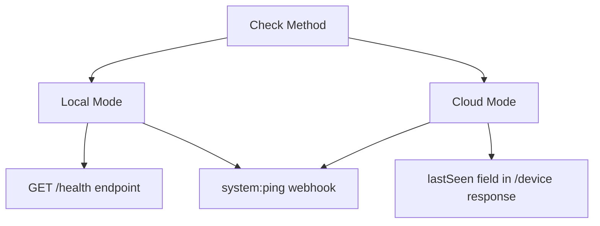

# ❓ FAQ - General

## 🙈 How to hide messages on the device?

SMS messages sent or received by the app are always visible in the device's default SMS application due to technical limitations in Android (introduced in Android 4.4 KitKat).

Making SMSGate the default SMS app could solve this problem, but we intentionally avoid implementing this to prevent misuse and maintain transparency.

!!! tip "Recommendation"
    - Restrict physical access to the phone
    - Set a strong PIN code
    - Use a dedicated Android device

## 📸 Can I send MMS messages?

The SMSGate app focuses on core SMS functionality and does not support sending MMS (Multimedia Messaging Service) messages. This design choice aligns with the principle of "do one thing, do it well"—ensuring reliable SMS delivery without complicating the application with additional, less critical features.

## 🤖 Does the app support Android 15?

The SMSGate app fully supports Android 15 (API level 35). However, due to enhanced privacy and security changes in the Android 15 permissions model, manual SMS permission setup is required to ensure proper functionality:

1. :material-android: Install [the latest app version](https://github.com/capcom6/android-sms-gateway/releases/latest)
2. :material-shield-key: Grant SMS permissions via ADB
    ```bash title="Grant SMS Permission via ADB"
    adb shell pm grant me.capcom.smsgateway android.permission.SEND_SMS
    ```
    or via the [Settings app](./errors.md#does-not-have-androidpermissionsend_sms)
3. :material-restart: Reboot device

!!! note "Community Contribution"
    Special thanks to *@mabushey* for solution!  
    [:material-github: Issue #184](https://github.com/capcom6/android-sms-gateway/issues/184)

## 📱 How can I send an SMS using the second SIM card?

The SMSGate app supports sending messages from multiple SIM cards simultaneously. To utilize a secondary SIM card for message sending, please refer to the comprehensive [Multi-SIM Support](../features/multi-sim.md) section for detailed setup instructions and configuration options.

## 🔋 Does the app require power saving mode to be turned off to function without interruptions?

The SMSGate app is designed to work reliably even when power saving modes are enabled, though specific behavior may vary depending on the device manufacturer and Android version. Below are details for each operational mode:

### Local Mode 🏠

- **Power saving settings:**  
  The app provides an option to disable battery optimizations directly from the *Settings* tab under the "System" section. This helps ensure uninterrupted operation.  
  The app also uses a foreground service with a wake lock, which allows it to function reliably even with power-saving mode enabled.  
- **Battery impact:**  
  Using a wake lock and disabling battery optimizations may lead to increased battery consumption.

### Cloud Mode ☁️

- **Power saving settings:**  
  Similar to Local Mode, disabling battery optimizations can enhance reliability. However, the app primarily relies on Firebase Cloud Messaging (FCM) push notifications, which functions without requiring power-saving mode to be turned off.  
- **Potential delays:**  
  High message rates could cause occasional delays when the device is in power-saving mode due to FCM's limitations on high-priority notifications.

!!! tip "Recommendation"
    - **Testing:**  
      Test the app with and without battery optimizations disabled to evaluate its performance on your device and Android version.  
    - **Device manufacturers:**  
      Behavior may vary depending on the device manufacturer and specific Android customizations.  
    - **Local + Cloud:**  
      For maximum responsiveness, consider using a local server alongside the cloud connection.  
    - **Don't Kill My App:**  
      Follow the [Don't Kill My App](https://dontkillmyapp.com) guide to ensure the app is not killed by the operating system.

## 📨 How do I enable or disable delivery reports for messages?

```json title="Disable Delivery Reports"
{
  "textMessage": { "text": "Your OTP: 1234"},
  "phoneNumbers": ["+1234567890"],
  "withDeliveryReport": false // (1)!
}
```

1. Default: `true` (reports enabled)

## #️⃣ Can I use long or non-standard phone numbers?

By default, the app requires the phone number to be in E.164 compatible format. You can bypass this requirement by using the `skipPhoneValidation` query parameter:

```bash title="Bypass Phone Validation via API"
curl -X POST "https://api.sms-gate.app/messages?skipPhoneValidation=true"
```

## 🚫 How can I avoid mobile operator restrictions?

=== "⏱️ Random Delay"

    **Settings Path**:  
    :gear: Settings → Messages → "Delay between messages"

    The random delay can be introduced between messages by specifying a minimum and maximum time. This helps to reduce the likelihood of messages being flagged as spam by simulating a more human-like sending pattern.

=== "📉 Message Limits"

    **Settings Path**:  
    :gear: Settings → Messages → Limits

    The app offers a feature to restrict the number of messages sent within a specified period—be it a minute, hour, or day. When the limit is reached, the app will pause sending messages until the limit period resets.

    !!! warning "Caution"
        This feature should not be used for time-sensitive messages, such as sending authorization codes, where delays could cause issues.

=== "🔄 SIM Card Rotation"

    **Settings Path**:  
    :gear: Settings → Messages → "If SIM number is not specified"

    The app provides a feature to rotate between [multiple SIM cards](../features/multi-sim.md#sim-card-rotation) automatically, avoiding reaching SIM limits.

## 📶 How can I check the online status of the device?

You can monitor the online status of your SMSGate device using multiple methods depending on your operational mode (Local, Cloud, or Private). Below is a visual overview of the available options:



### Local mode

Attempting to connect to the device's API directly can give you an immediate sense of its online status. Accessing the `/health` endpoint is a straightforward way to do this.

### Cloud mode

The app operates asynchronously, relying on PUSH notifications rather than maintaining a continuous connection to the server. You can use the `GET /device` endpoint to obtain some information about the device's state. The response includes a `lastSeen` field, showing the last time the device connected to the server. Due to the app's idle mode behavior, the device may only connect to the server once every 15 minutes, meaning the `lastSeen` time may not always represent the current status.

### Any mode

Irrespective of the mode, you can register a `system:ping` webhook to monitor the device's online status. This webhook will notify your server about the status of the app at user-defined intervals, set within the app's Settings on the device. This feature offers a proactive approach to track connectivity and ensure the device is functioning as expected across any operational mode.

!!! warning "Caution"
    Using the ping feature will increase battery usage. It's important to balance the need for frequent status updates with the impact on device battery life, especially if the device is expected to operate for extended periods without charging.

## 📛 Can I send SMS with a custom sender name?

The app uses your SIM card to send messages, so by default, it uses the same sender information as your phone's default messaging app (usually your phone number). Any changes to the sender name would need to be set up through your carrier, not within the app itself.

!!! question "Carrier-Dependent"
    Contact your mobile provider for:

    - Alphanumeric Sender ID services
    - Business SMS solutions  

## 🔑 How do I change my password?

| Mode          | Documentation                                                                        |
| ------------- | ------------------------------------------------------------------------------------ |
| Local         | [Server Config](../getting-started/local-server.md#server-configuration)             |
| Cloud/Private | [Password Management](../getting-started/public-cloud-server.md#password-management) |

## 💬 Does the app support RCS messaging?

Currently, the app does not support RCS (Rich Communication Services) messaging. It is recommended to disable RCS in Google Messages to avoid [issues](./webhooks.md#the-smsreceived-webhook-is-not-triggering-material-message-question).

!!! failure "Reasons"
    1. No public API from Google
    2. Fragmented ecosystem (Samsung/Apple)
    3. No standardization for third-party apps
    
    [Google Support Thread](https://support.google.com/messages/thread/247624435)
