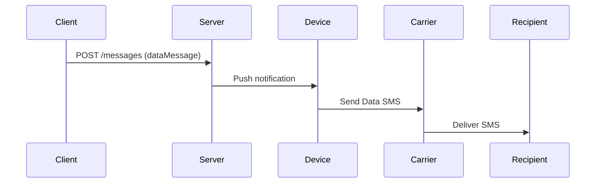
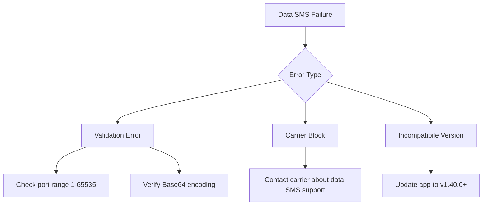

# Data SMS Support 📡

> Introduced in Android app v1.40.0 and compatible servers

The Data SMS feature enables the transmission of binary data payloads via traditional SMS. This allows for compact data exchange (up to 140 bytes per message) without requiring mobile data connectivity. Use cases include IoT device control commands, encrypted message delivery, and silent OTP authentication.

!!! note "Carrier Compatibility"
    Most major carriers support data SMS, but capabilities may vary by region.
    Check with your carrier if you encounter delivery issues.

## Use Cases 🧩

- **Binary Data Transmission**: Send device commands, encrypted payloads, or custom protocols
- **Silent OTPs**: Deliver authentication tokens without user notification
- **Bandwidth Efficiency**: Compact data formats (up to 140 bytes per message)
- **Background Operation**: Process messages without interrupting users

## Technical Implementation ⚙️

### Requirements

- Android app v1.40.0+
- Local server mode or compatible cloud/private server
- `SEND_SMS` permission granted
- Carrier support for data SMS (most major carriers support this)

### Payload Constraints

| Aspect     | Limit     | Notes                          |
| ---------- | --------- | ------------------------------ |
| Max size   | 140 bytes | Carrier-dependent, may vary    |
| Encoding   | Base64    | Required for API compatibility |
| Port range | 1-65535   | Fixed receive port: 53739      |

### API Usage

## Compatibility 📱

### App/Server Matrix

|                    | App <1.40.0 | App ≥1.40.0            |
| ------------------ | ----------- | ---------------------- |
| **Server <1.24.0** | Text only   | Local server mode only |
| **Server ≥1.24.0** | Text only   | Full data support      |

## Pros and Cons ⚖️

| Advantages                     | Limitations                              |
| ------------------------------ | ---------------------------------------- |
| ✅ No user interaction required | ❌ Smaller payload size than text SMS     |
| ✅ Works without mobile data    | ❌ Delivery reliability varies by carrier |

## Troubleshooting 🛠️

### Common Issues

### Debugging Steps

1. Check app logs for errors
2. Verify carrier supports data SMS
3. Validate Base64 payloads externally
4. Check for Android system updates

## See Also 📚

- [Sending Messages](./sending-messages.md) - Comprehensive guide to message sending options
- [Webhook Integration](./webhooks.md) - Configuring delivery notifications
- [Encryption Overview](../privacy/encryption.md) - Securing your data transmissions
