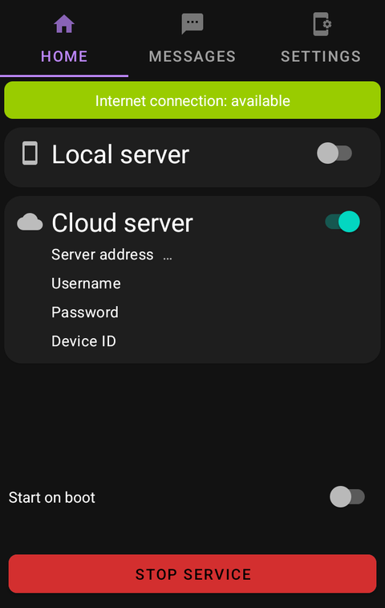
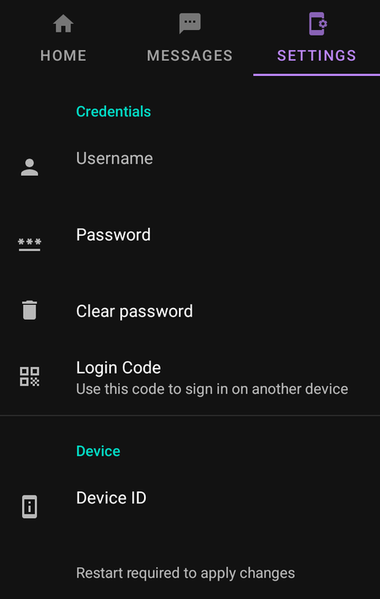

# 📱📱 Multi-Device Support

The app supports multiple devices for a single account in **Cloud** or **Private Server** modes, distributing messages across all connected devices.

## ➕ Adding a Device

=== ":material-account-key: Username & Password"
    !!! tip
        Use this method for trusted devices, which will have full access to the account.

    **Steps 📋**

    1. Open app on new device
    2. Activate :material-cloud: **Cloud Server**
    3. Tap "Offline" → "Sign In" tab
    4. Enter username and password
    5. Wait for Cloud Server information in the Home tab

    <figure markdown>
      { width="400" align=center }
      <figcaption>Home tab with Cloud server enabled and the credentials still empty</figcaption>
    </figure>

=== ":material-lock-reset: One-Time Code"
    !!! tip
        Use this method for untrusted devices, which will only have limited access to the account.

    **Generate Code 🔑**

    1. On active device:  
       :gear: Settings → Cloud Server → Login code
    2. Wait for code to appear
    3. Long press to copy

    <figure markdown>
      { width="400" align=center }
      <figcaption>Login Code control used to sign in on another device</figcaption>
    </figure>

    **Apply Code 📲**

    1. Activate Cloud Server
    2. Choose "By Code" tab
    3. Enter the code
    4. Confirm with "Continue"

## 📨 Message Distribution

=== ":fontawesome-solid-dice: Random Selection (Default)"
    ```bash
    curl https://api.sms-gate.app/3rdparty/v1/messages \
      -u "username:password" \
      --json '{
        "textMessage": {"text": "Test message"},
        "phoneNumbers": ["+19162255887"]
    }'
    ```

=== ":material-target: Explicit Selection"
    ```bash
    curl https://api.sms-gate.app/3rdparty/v1/messages \
      -u "username:password" \
      --json '{
        "textMessage": {"text": "Test message"},
        "phoneNumbers": ["+19162255887"],
        "deviceId": "dev_abc123"
    }'
    ```

## ⚙️ Device Management

### API Endpoints

=== ":material-api: List Devices"
    ```bash
    curl -X GET \
      https://api.sms-gate.app/3rdparty/v1/devices \
      -u "username:password"
    ```
    [API Documentation](https://api.sms-gate.app/#/User/get_3rdparty_v1_devices)

=== ":material-delete: Remove Device"
    ```bash
    curl -X DELETE \
      https://api.sms-gate.app/3rdparty/v1/devices/DEVICE_ID \
      -u "username:password"
    ```
    [API Documentation](https://api.sms-gate.app/#/User/delete_3rdparty_v1_devices__id_)

!!! danger "Device Removal Warning"
    Deleting a device will remove all associated messages, including pending ones. This action cannot be undone.
