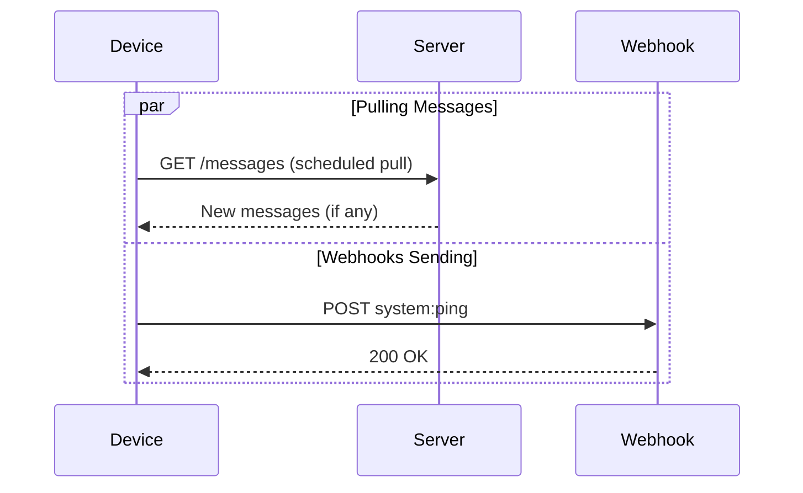
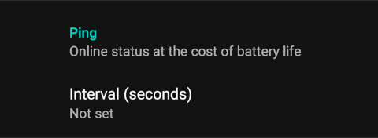

# Ping 🏓

The Ping feature enables real-time monitoring of device connectivity and health, while also allowing you to adjust the default message pull frequency in both Cloud and Private server modes.

## Use Cases 🔍

- :material-cloud-sync: **Scheduled Pulls**
    - Override the default 15-minute interval
    - Ensure timely message delivery
    - Configure frequency as needed

- :material-heart-pulse: **Health Monitoring**
    - Regular `system:ping` webhooks
    - Track device connectivity status

!!! warning "Battery Considerations"
    Enabling the Ping feature may increase battery usage. It's crucial to balance the need for frequent status updates with the impact on device battery life, especially for devices expected to operate for extended periods without charging.

## Configuration ⚙️

1. Navigate to :gear: **Settings** → **Ping**
2. Set the interval in seconds

<figure markdown>
  { width="400" align=center }
  <figcaption>Ping configuration interface</figcaption>
</figure>

## See Also 📚

- [Cloud Server](../getting-started/public-cloud-server.md)
- [Private Server](../getting-started/private-server.md)
- [Webhooks](../features/webhooks.md)
- [Health Checks](../features/health.md)
