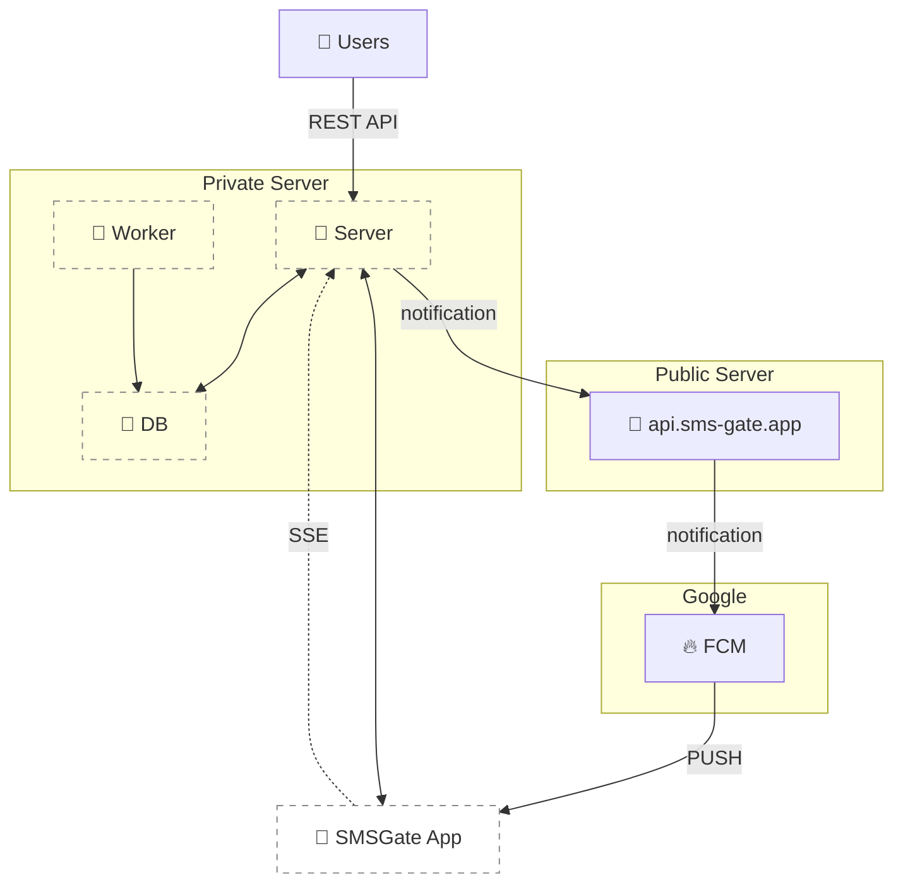

# Private Server 🛡️

To enhance privacy and control, you can host your own private server. This keeps all message data within your infrastructure while maintaining push notification capabilities through our public server at `api.sms-gate.app`. This setup eliminates the need to configure Firebase Cloud Messaging (FCM) or rebuild the Android app, but it does demand some technical know-how.

<center>

</center>

## Prerequisites ✅

=== "🐳 With Docker"
    - Docker installed on Linux VPS
    - MySQL/MariaDB server with empty database and privileged user
    - Reverse proxy with valid SSL certificate ([project CA](../services/ca.md) supported)

=== "🖥️ From Sources"
    - Git and Go 1.23+ toolchain
    - MySQL/MariaDB server with empty database and privileged user
    - Reverse proxy with valid SSL certificate ([project CA](../services/ca.md) supported)

=== "📦 With Helm"
    - Kubernetes cluster with Helm 3+

## Installation Methods 📦

=== "🐳 With Docker"

    ```sh title="Docker Command"
    docker run -d --name sms-gateway \
        -p 3000:3000 \
        -v $(pwd)/config.yml:/app/config.yml \
        ghcr.io/android-sms-gateway/server:latest
    ```

=== "🖥️ From Sources"

    1. **Build the binary**
    ```sh
    git clone https://github.com/android-sms-gateway/server.git
    cd server
    go build -o sms-gateway ./cmd/sms-gateway
    chmod +x sms-gateway
    ```

    2. **Run database migrations**
    ```sh
    ./sms-gateway db:migrate up
    ```

    3. **Launch the server**
    ```sh
    ./sms-gateway
    ```

=== "📦 With Helm"

    1. **Add the chart repository**
    ```sh
    helm repo add sms-gate https://s3.sms-gate.app/charts
    helm repo update
    ```

    2. **Create values.yaml file**
    ```yaml title="values.yaml"
    image:
      pullPolicy: IfNotPresent

    database:
      deployInternal: true
      mariadb:
        rootPassword: ${GENERATE_MARIADB_ROOT_PASSWORD}
      password: ${GENERATE_DATABASE_PASSWORD}

    gateway:
      privateToken: ${GENERATE_PRIVATE_TOKEN}
    ```

    3. **Install the chart**
    ```sh
    helm upgrade --install sms-gate-server sms-gate/server \
        --create-namespace \
        --namespace sms-gate \
        --values values.yaml
    ```
    !!! danger "Security Warning"  
        **Never commit secrets to version control!**  
        Replace placeholder values with actual high-entropy secrets:
        
        - Generate unique passwords/tokens using: `openssl rand -base64 32`
        - Use environment variables or secret management tools
        - Consider [sealed-secrets](https://github.com/bitnami-labs/sealed-secrets) for Kubernetes
        - Use cloud secret managers (AWS Secrets Manager, Azure Key Vault, GCP Secret Manager)

    For detailed Helm chart documentation, see [Helm Chart Documentation](https://github.com/android-sms-gateway/server/blob/master/deployments/helm-chart/README.md).

## Reverse Proxy Configuration 🌐

### Example Nginx Configuration

```nginx title="Example Nginx Config"
location / {
    proxy_pass http://localhost:3000;
    proxy_set_header Host $host;
    proxy_set_header X-Forwarded-For $remote_addr;
}
```

### Advanced Configuration

For SSL termination and advanced routing scenarios, consider:

- Enabling HTTP/2 support
- Configuring proper timeout values
- Adding security headers
- Setting up rate limiting
- Implementing proxying for SSE connections

## Background Worker ⚙️

The background worker operates as a separate process from the main server and handles these core maintenance tasks:

- **`devices:cleanup`**: Removes inactive devices older than retention period
- **`messages:cleanup`**: Cleans up old message records
- **`messages:hashing`**: Processes message content for privacy compliance

### Launching the Worker

=== "🐳 With Docker"

    ```sh title="Docker Command"
    docker run -d --name sms-gateway-worker \
        -v $(pwd)/config.yml:/app/config.yml \
        ghcr.io/android-sms-gateway/server:latest \
        /app/app worker
    ```

=== "🖥️ From Sources"

    Use the same binary as the main server:

    ```sh
    ./sms-gateway worker
    ```

=== "📦 With Helm"

    The Helm chart automatically deploys the worker as a separate deployment. No additional configuration is needed beyond the main `values.yaml`.

### Worker Configuration

The worker uses the following sections from the `config.yml`:

```yaml
http:
  listen: :3000  # Metrics endpoint
database:
  host: localhost
  port: 3306
  user: root
  password: root
  database: sms
  timezone: UTC
tasks:
  devices_cleanup:
    interval: 24h
    max_age: 720h  # 30 days
  messages_cleanup:
    interval: 24h
    max_age: 720h  # 30 days
  messages_hashing:
    interval: 168h  # 7 days
```

### Monitoring

The worker exposes Prometheus metrics at `/metrics`:

- `worker_executor_active_tasks_total`: Current running tasks count
- `worker_executor_task_result_total{task, result}`: Task success/failure counts
- `worker_executor_task_duration_seconds{task}`: Task execution duration histogram

For production deployments, set up alerts for:

- Task failures exceeding threshold (monitor `worker_executor_task_result_total{result="error"}`)
- Tasks running longer than expected (monitor `worker_executor_task_duration_seconds`)
- Worker process downtime (monitor process uptime)

### Operational Best Practices

- **Task Configuration**: Adjust intervals based on your data volume and retention requirements
- **Batch Processing**: For high-volume systems, consider shorter intervals with smaller batch sizes
- **Zero-Downtime Updates**: Worker can be restarted independently of the main server
- **Lock Management**: The worker uses MySQL named locks (e.g., `worker:devices:cleanup`) to coordinate execution
