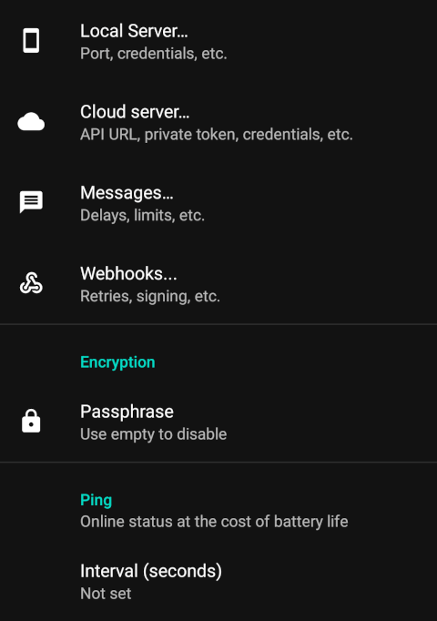
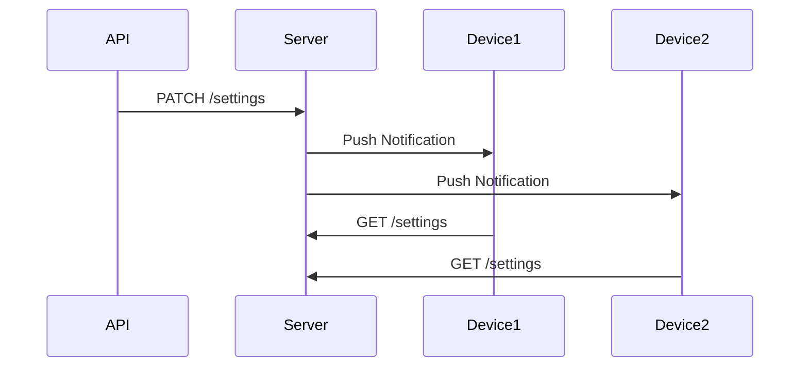

# Device Settings Management ⚙️

## Introduction 📖

Device settings can be managed through the app's user interface or programmatically via the API. This document describes both methods.

## Settings Management Methods 

=== ":material-cellphone-settings: UI Management"
    The primary way to manage device settings is through the Settings tab within the app. This provides a user-friendly interface for configuring various parameters.

    <figure markdown>
      
      <figcaption>Device settings interface</figcaption>
    </figure>

=== ":material-api: API Management"
    The app also provides API endpoints for managing device settings. This allows for programmatic access to device settings, making it easier to retrieve and apply configurations across multiple devices.

    ### Server Modes 🔄
    | Mode                           | Storage | Scope               |
    | ------------------------------ | ------- | ------------------- |
    | :material-cellphone: Local     | Device  | Single device       |
    | :material-cloud: Cloud/Private | Server  | All account devices |

## Settings Management API 🌐

The API provides the `/settings` endpoint for settings management:

| Method  | Local mode                  | Cloud/Private mode            |
| ------- | --------------------------- | ----------------------------- |
| `GET`   | Returns all device settings | Returns account-wide settings |
| `PATCH` | Partially updates settings  | Partially updates settings    |
| `PUT`   | Not Available               | Fully replaces settings       |

### Configuration Parameters ⚙️

The settings parameters are represented as a JSON object. The structure includes the following:

```json
{
    "gateway": {
        "notification_channel": "AUTO"
    },
    "logs": {
        "lifetime_days": 30
    },
    "messages": {
        "limit_period": "Disabled",
        "limit_value": null,
        "log_lifetime_days": null,
        "send_interval_max": null,
        "send_interval_min": null,
        "sim_selection_mode": "OSDefault"
    },
    "ping": {
        "interval_seconds": null
    },
    "webhooks": {
        "internet_required": true,
        "retry_count": 1
    }
}
```

When operating in Local mode, you can also configure the following Cloud/Private mode parameters:

```json
{
    "encryption": {
        "passphrase": null
    },
    "gateway": {
        "cloud_url": "https://api.sms-gate.app/mobile/v1",
        "private_token": null
    },
    "webhooks": {
        "signing_key": null
    }
}
```

!!! note
    All settings are nullable. Passing `null` to any setting will reset it to its default value.

!!! warning
    The following settings are **write-only** for security reasons and cannot be read via the API:

    - `encryption.passphrase`
    - `webhooks.signing_key`
    - `gateway.private_token`

### Push Notifications for Syncing Settings 📱

In Cloud/Private mode, when settings are changed via the API, a push notification is sent to all devices in the account to sync the settings.



### Security Considerations 🔐

When device settings are changed via the API, the app will display a notification to the user for security purposes, allowing the user to review the changes. Some settings will be applied immediately, while others will be applied after the app is restarted.

## See Also 📚

* [API Documentation](https://api.sms-gate.app/#/Settings)
* [Cloud Server Setup](../getting-started/public-cloud-server.md)
* [Private Server Setup](../getting-started/private-server.md)
