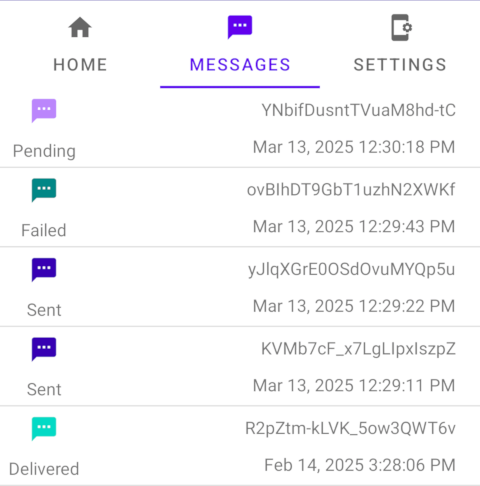
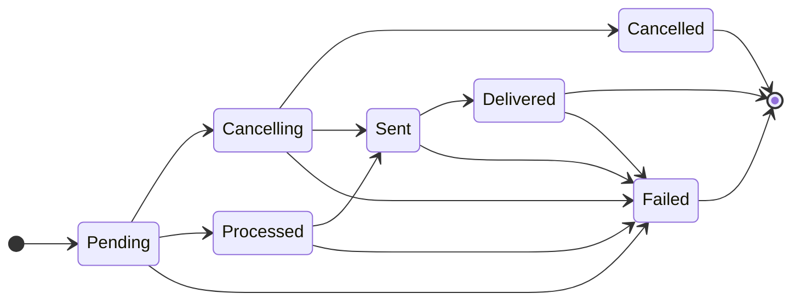

# Status Tracking 📡

The app allows you to track the status of messages using multiple methods.

## Tracking Methods 🔍

=== ":material-cellphone: App Interface"
    <figure markdown>
      { width="480" align=center }
      <figcaption>Message status indicators in app</figcaption>
    </figure>

=== ":material-cloud: Webhooks"
    ```json title="Sample Webhook Payload"
    {
      "event": "sms:failed",
      "payload": {
        "messageId": "zXDYfTmTVf3iMd16zzdBj",
        "sender": "+1234567890",
        "recipient": "+9876543210",
        "phoneNumber": "+9876543210",
        "simNumber": 1,
        "failedAt": "2024-02-20T15:30:00Z",
        "reason": "Invalid number"
      }
    }
    ```
    [Webhook Setup Guide](../features/webhooks.md) :material-arrow-right:

=== ":material-api: REST API"
    ```bash title="Get Status via API"
    curl -X GET https://api.sms-gate.app/3rdparty/v1/messages/zXDYfTmTVf3iMd16zzdBj \
      -u "user:pass"
    ```
    [API Documentation](https://capcom6.github.io/android-sms-gateway/#/Messages/get-message-id) :material-book-open-page-variant:

=== ":material-console-line: CLI Tool"
    ```bash title="Check Status via CLI"
    smsgate --format=json status zXDYfTmTVf3iMd16zzdBj
    ```
    ```json
    {
      "id": "zXDYfTmTVf3iMd16zzdBj",
      "state": "Failed",
      "reason": "Invalid number"
    }
    ```

---

## Message Lifecycle 🔄


```mermaid
stateDiagram-v2
    direction LR
    [*] --> Pending
    Pending --> Cancelling
    Cancelling --> Cancelled
    Cancelling --> Sent
    Cancelling --> Failed
    Cancelled --> [*]
    Pending --> Processed
    Processed --> Sent
    Sent --> Delivered
    Delivered --> [*]
    Failed --> [*]
    Pending --> Failed
    Processed --> Failed
    Sent --> Failed
    Delivered --> Failed
```

### Status Definitions 🚦

- :hourglass: **Pending**  
  Message queued, awaiting device processing
- :no_entry: **Cancelling**  
  Server requested cancellation, awaiting device confirmation
- :no_entry: **Cancelled**  
  Message successfully cancelled before processing
- :gear: **Processed**  
  Device prepared message, handed to Android SMS API
- :outbox_tray: **Sent**  
  SMSC accepted message (Android API confirmation)
- :inbox_tray: **Delivered**  
  Recipient device confirmed receipt (requires [`"withDeliveryReport": true`](https://capcom6.github.io/android-sms-gateway/#/Messages/post-message))
- :x: **Failed**  
  Terminal error at any stage

!!! warning "Messages Stuck in `Processed`"
    `Processed` is terminal-unless-confirmed, and there is no automatic recovery.

    Once a message reaches `Processed`, the app never looks at it again. If the confirmation
    for that one message gets lost somewhere, there is nothing that checks back on it later,
    so it can sit there forever.

    This is deliberate:

    - The app will **not** auto-resend it, because the message could have been sent, and
      resending it could mean a duplicate.
    - The app will **not** mark it `Failed`, because we simply do not know what happened.

    **What to do as an operator:**

    - Treat a message still in `Processed` past your expected send window as
      **indeterminate**, not as failed and not as sent.
    - Do **not** blindly retry it. A retry can produce a duplicate delivery and a duplicate
      charge from the carrier.
    - Reconcile against your own outbound log or the recipient's delivery receipts to learn
      what actually happened.

    A message only leaves `Processed` when the Android SMS API confirmation arrives; there is
    no re-scan, no sweeper, and no timeout that moves it on.

## Message Scenarios 📨

=== "📨 Multipart Messages"

    | Condition          | Result Status          |
    | ------------------ | ---------------------- |
    | All parts sent     | :outbox_tray: Sent     |
    | Any part delivered | :inbox_tray: Delivered |
    | Any part failed    | :x: Failed (terminal)  |

=== "👥 Multiple Recipients"
    
    | Condition     | Result Status          |
    | ------------- | ---------------------- |
    | Any pending   | :hourglass: Pending    |
    | Any processed | :gear: Processed       |
    | All cancelled | :no_entry: Cancelled   |
    | All delivered | :inbox_tray: Delivered |
    | All failed    | :x: Failed             |
    | Otherwise     | :outbox_tray: Sent     |

## Message Status Fields

The message status response (`GET /3rdparty/v1/messages/{id}`) includes the following fields:

| Field        | Type   | Description                                                           |
| ------------ | ------ | --------------------------------------------------------------------- |
| `id`         | string | Unique message identifier                                             |
| `state`      | string | Current state (`Pending`, `Processed`, `Sent`, `Delivered`, `Failed`) |
| `states`     | object | History of previous message states (map of state name to timestamp)   |
| `recipients` | array  | Per-recipient delivery states                                         |

## Delivery Reports 📋

If the app receives an error code in the delivery report, the action depends on the type of the error:

* **Permanent error**: the status changes to `Failed`
* **Temporary error without retries**: the status changes to `Failed`
* **Temporary error with retries**: ignored, the status doesn't change

!!! warning "Temporary Errors"
    The Android OS may not report the final status of the message after a temporary error. In this case the message remains in the `Sent` state even if it was successfully delivered.

!!! tip "Error Code Reference"
    Full SMSC error codes documented in [GSM 03.40 Specification](https://www.etsi.org/deliver/etsi_gts/03/0340/05.03.00_60/gsmts_0340v050300p.pdf) :material-file-pdf-box:
