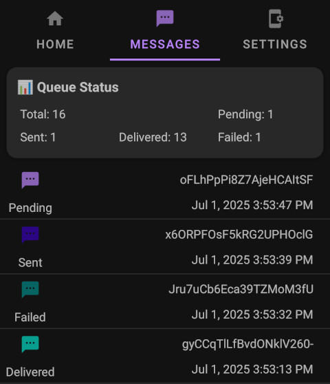

# Status Tracking 📡

The app allows you to track the status of messages using multiple methods.

## Tracking Methods 🔍

=== ":material-cellphone: App Interface"
    <figure markdown>
      { width="360" align=center }
      <figcaption>Message status indicators in app</figcaption>
    </figure>

=== ":material-cloud: Webhooks"
    ```json title="Sample Webhook Payload"
    {
      "event": "sms:failed",
      "payload": {
        "messageId": "zXDYfTmTVf3iMd16zzdBj",
        "reason": "Invalid number",
        "failedAt": "2024-02-20T15:30:00Z"
      }
    }
    ```
    [Webhook Setup Guide](../features/webhooks.md) :material-arrow-right:

=== ":material-api: REST API"
    ```bash title="Get Status via API"
    curl -X GET https://api.sms-gate.app/3rdparty/v1/messages/zXDYfTmTVf3iMd16zzdBj \
      -u "user:pass"
    ```
    [API Documentation](https://capcom6.github.io/android-sms-gateway/#/Messages/get-message-id) :material-book-open-page-variant:

=== ":material-console-line: CLI Tool"
    ```bash title="Check Status via CLI"
    smsgate --format=json status zXDYfTmTVf3iMd16zzdBj
    ```
    ```json
    {
      "id": "zXDYfTmTVf3iMd16zzdBj",
      "state": "Failed",
      "reason": "Invalid number"
    }
    ```

---

## Message Lifecycle 🔄


### Status Definitions 🚦

- :hourglass: **Pending**  
  Message queued, awaiting device processing
- :gear: **Processed**  
  Device prepared message, handed to Android SMS API
- :outbox_tray: **Sent**  
  SMSC accepted message (Android API confirmation)
- :inbox_tray: **Delivered**  
  Recipient device confirmed receipt (requires [`"withDeliveryReport": true`](https://capcom6.github.io/android-sms-gateway/#/Messages/post-message))
- :x: **Failed**  
  Terminal error at any stage

## Message Scenarios 📨

=== "Multipart Messages 📨"

    | Condition          | Result Status          |
    | ------------------ | ---------------------- |
    | All parts sent     | :outbox_tray: Sent     |
    | Any part delivered | :inbox_tray: Delivered |
    | Any part failed    | :x: Failed (terminal)  |

=== "Multiple Recipients 👥"
    
    | Condition     | Result Status          |
    | ------------- | ---------------------- |
    | Any pending   | :hourglass: Pending    |
    | Any processed | :gear: Processed       |
    | All delivered | :inbox_tray: Delivered |
    | All failed    | :x: Failed             |
    | Otherwise     | :outbox_tray: Sent     |

## Delivery Reports 📋

If the app receives an error code in the delivery report, the action depends on the type of the error:

* **Permanent error**: the status changes to `Failed`
* **Temporary error without retries**: the status changes to `Failed`
* **Temporary error with retries**: ignored, the status doesn't change

!!! warning "Temporary Errors"
    The Android OS may not report the final status of the message after a temporary error. In this case the message remains in the `Sent` state even if it was successfully delivered.

!!! tip "Error Code Reference"
    Full SMSC error codes documented in [GSM 03.40 Specification](https://www.etsi.org/deliver/etsi_gts/03/0340/05.03.00_60/gsmts_0340v050300p.pdf) :material-file-pdf-box:
