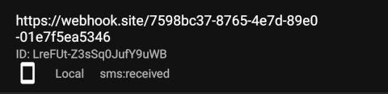

# Webhooks 🌐

Webhooks offer a powerful mechanism to receive real-time notifications of events like incoming SMS messages. This integration guide will walk you through setting up webhooks to receive such notifications directly from your device.

## Supported Events 📩

<div class="grid cards" markdown>

- :incoming_envelope: **sms:received**
    - `messageId`: Content-based ID  
    - `message`: SMS content  
    - `phoneNumber`: Sender's number  
    - `simNumber`: SIM index (nullable)  
    - `receivedAt`: Local timestamp

- :outbox_tray: **sms:sent**
    - `messageId`: Unique ID  
    - `phoneNumber`: Recipient  
    - `simNumber`: SIM index (nullable)  
    - `sentAt`: Local timestamp

- :white_check_mark: **sms:delivered**
    - `messageId`: Unique ID  
    - `phoneNumber`: Recipient  
    - `simNumber`: SIM index (nullable)  
    - `deliveredAt`: Local timestamp

- :x: **sms:failed**
    - `messageId`: Unique ID  
    - `phoneNumber`: Recipient
    - `simNumber`: SIM index (nullable) 
    - `reason`: Error details  
    - `failedAt`: Local timestamp

- :ping_pong: **system:ping**
    - `health`: [Healthcheck status](./health.md)

</div>

## Prerequisites ✅

Before you begin, ensure the following:

- ⚠️ You have [SMS Gateway for Android™](https://github.com/capcom6/android-sms-gateway/releases/latest) installed on your device in **Local**, **Cloud**, or **Private** mode.
- 🔒 You have a server with a valid SSL certificate to securely receive HTTPS requests. You can use [project's certificate authority (CA)](../services/ca.md) to generate a valid certificate for IP addresses. Alternatively, use services like [ngrok](https://ngrok.com) to generate a public HTTPS endpoint.
- 🌐 Your device has access to your server. If you operate entirely within your local network without Internet access, please see [FAQ](../faq/webhooks.md#how-to-use-webhooks-without-internet-access)

## Step-by-Step Integration 📋

### Step 1: Set Up Your Server 🖥️

For your webhooks to work, you need an HTTP server capable of handling HTTPS POST requests. This server will be the endpoint for the incoming webhook data.

- **Production**: Use a valid SSL certificate.
- **Testing**: Tools like [webhook.site](https://webhook.site) provide temporary endpoints to capture payloads.

### Step 2: Register Your Webhook Endpoint 📝

To start receiving webhook notifications, you must register your webhook endpoint with the device. Utilize the `curl` command to send a POST request to the appropriate address, depending on whether you're in Local, Cloud, or Private mode.

- **Local mode**: Use the device’s local IP and port (e.g., `https://192.168.1.10:8080/webhooks`).
- **Private mode**: Use your server’s domain name or IP and port (e.g., `https://your-server.com/3rdparty/v1/webhooks`).
- **Cloud mode**: Use `https://api.sms-gate.app/3rdparty/v1/webhooks`.

```sh title="Cloud mode example"
curl -X POST -u <username>:<password> \
  -H "Content-Type: application/json" \
  -d '{ "url": "https://your-server.com/webhook", "event": "sms:received" }' \
  https://api.sms-gate.app/3rdparty/v1/webhooks
```

Replace:

- `<username>:<password>`: Credentials from the Home tab of the app.
- `https://your-server.com/webhook`: The URL of your webhook endpoint.
- `https://api.sms-gate.app/3rdparty/v1/webhooks`: The appropriate URL for your mode.

In Cloud and Private modes, please allow some time for the webhooks list to synchronize with your device.

!!! note "Multiple Events"
    Each webhook is registered for a single event. To listen for multiple events, register separate webhooks.

!!! tip "Device-Specific Webhooks"
    To register a webhook for a specific device, include the `device_id` parameter in the API request. If the `device_id` is not provided, the webhook will be applied to all devices associated with the account.

    ```sh title="Cloud mode example"
    curl -X POST -u <username>:<password> \
    -H "Content-Type: application/json" \
    -d '{ "url": "https://your-server.com/webhook", "event": "sms:received", "device_id": "DEVICE_ID" }' \
    https://api.sms-gate.app/3rdparty/v1/webhooks
    ```

### Step 3: Verify Your Webhook ✔️

=== "Via API Method :material-api:"

    You can verify that it has been successfully registered by executing the following `curl` command:

    ```sh title="Cloud mode example"
    curl -X GET -u <username>:<password> \
      https://api.sms-gate.app/3rdparty/v1/webhooks
    ```

    !!! note "Separate Lists"
        **Local mode** and **Cloud/Private mode** maintain separate webhook lists. Use the corresponding API URL to view registrations.

=== "Via App Interface :material-cellphone:"

    1. Open the SMS Gateway app 📱
    2. Navigate to **Settings** > **Webhooks** > **Registered webhooks** 
    3. The list shows all configured webhooks with:
          - Endpoint URL
          - Webhook ID
          - Event type
          - Source (Local/Cloud)  
    <center>
    
    </center>  
    You can copy the webhook ID by clicking on the row.

### Step 4: Test the Webhook 🧪

- **For `sms:received`**: Send an SMS to the device.
- **For `sms:sent`/`delivered`/`failed`**: Send an SMS *from* the app to trigger these events.
- **For `system:ping`**: Enable the ping feature in the app’s **Settings > Ping**.

### Step 5: Receive the Payload 📤

Your server will receive a POST request with a payload like:

```json
{
  "deviceId": "ffffffffceb0b1db0000018e937c815b",
  "event": "sms:received",
  "id": "Ey6ECgOkVVFjz3CL48B8C",
  "payload": {
    "messageId": "abc123",
    "message": "Android is always a sweet treat!",
    "phoneNumber": "6505551212",
    "simNumber": 1,
    "receivedAt": "2024-06-22T15:46:11.000+07:00"
  },
  "webhookId": "<unique-id>"
}
```

!!! important "Timely Response"
    Your server **must** respond with a 2xx status within 30 seconds to prevent retries

#### Retry Policy

The app implements an exponential backoff retry strategy: it waits 10 seconds before the first retry, then 20 seconds, 40 seconds, and so on, doubling the interval each time. By default, the app will retry 14 times (approximately 2 days) before giving up. You can specify a custom retry count in the app's **Settings > Webhooks**.

### Step 6: Deregister a Webhook 🗑️

If you no longer wish to receive webhook notifications, deregister your webhook with the following curl command:

```sh title="Cloud mode example"
curl -X DELETE -u <username>:<password> \
  'https://api.sms-gate.app/3rdparty/v1/webhooks/%3Cunique-id%3E'
```

## Security Considerations 🔐

- **Review Registered Webhooks Periodically**: Regularly audit your webhooks to verify URLs are valid and guard against unauthorized or stale endpoints.
- **Use HTTPS**: Encrypts data in transit.
- **Secure Your Endpoint**: Protect your webhook endpoint against unauthorized access. For example, you can specify authorization key as query-parameter when registering the webhook.
- **Rotate Credentials**: Regularly update passwords.

### Payload Signing 🔏

Webhook requests are signed with HMAC-SHA256 for verification. The device includes these headers:

- `X-Signature` - Hexadecimal HMAC signature
- `X-Timestamp` - Unix timestamp (seconds) used in signature generation

The signing key is randomly generated at first request and can be changed in **Settings → Webhooks → Signing Key**

<figure markdown>
  { width="360" align=center }
  <figcaption>Webhook signing key configuration</figcaption>
</figure>

**Verification process:**

1. Get raw request body **as received** (before JSON parsing)
2. Concatenate with `X-Timestamp` value
3. Compute HMAC-SHA256 using the signing key
4. Compare result with `X-Signature` header

=== "Go"

    ``` go
    package webhooks

    import (
      "crypto/hmac"
      "crypto/sha256"
      "encoding/hex"
    )

    func VerifySignature(secretKey, payload, timestamp, signature string) bool {
      message := payload + timestamp
      mac := hmac.New(sha256.New, []byte(secretKey))
      mac.Write([]byte(message))
      expectedMAC := mac.Sum(nil)
      expectedSignature := hex.EncodeToString(expectedMAC)

      return hmac.Equal([]byte(expectedSignature), []byte(signature))
    }
    ```

=== "Python"

    ``` python
    import hmac
    import hashlib


    def verify_signature(secret_key: str, payload: str, timestamp: str, signature: str) -> bool:
        message = (payload + timestamp).encode()
        expected_signature = hmac.new(secret_key.encode(), message, hashlib.sha256).hexdigest()
        return hmac.compare_digest(expected_signature, signature)
    ```

=== "JavaScript"

    ``` js
    const crypto = require('crypto');

    function verifySignature(secretKey, payload, timestamp, signature) {
        const message = payload + timestamp;
        const expectedSignature = crypto
            .createHmac('sha256', secretKey)
            .update(message)
            .digest('hex');

        return expectedSignature === signature;
    }
    ```

=== "PHP"

    ``` php
    <?php 
    function verify_signature($secret_key, $payload, $timestamp, $signature) {
        $message = $payload . $timestamp;
        $expected_signature = hash_hmac('sha256', $message, $secret_key);

        return hash_equals($expected_signature, $signature);
    }
    ```

!!! tip "Best Practices"
    - Use constant-time comparison to prevent timing attacks.
    - Validate timestamps (e.g., accept only timestamps within ±5 minutes) to prevent replay attacks.
    - Store secret keys securely (e.g., environment variables, secure vaults).

## Troubleshooting 🛠️

!!! failure "No Webhooks Received?"
    1. Verify the webhook URL is correct
    2. Ensure the device can reach your server
    3. Verify SSL certificate validity
    4. Check device and server logs
    5. Test with [webhook.site](https://webhook.site) temporary endpoint

!!! bug "Signature Validation Issues"
    - Ensure timestamp is UTC Unix time in seconds
    - Use raw body before JSON decoding

## References 📚

- [FAQ](../faq/webhooks.md)
- [Private Webhook Certificate Setup](../services/ca.md#private-webhook-certificate)
- [API Documentation](https://capcom6.github.io/android-sms-gateway/#/Webhooks)

## Examples 💡

- [Flask webhook processor](https://github.com/android-sms-gateway/example-webhooks-flask): Demonstrates registration, HMAC validation, and payload handling with Flask.
- [FastAPI webhook processor](https://github.com/android-sms-gateway/example-webhooks-fastapi): Demonstrates registration, HMAC validation, and payload handling with FastAPI.
- [Telegram Forwarder Function](https://github.com/android-sms-gateway/example-telegram-forwarder-fn): Forwards SMS to Telegram using a cloud function.
- [Web Client](https://github.com/android-sms-gateway/web-client-ts): Node.js client for sending/receiving SMS via Socket.io.
