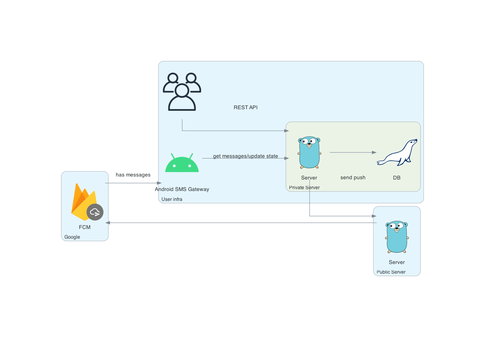

# Getting Started 🚀

## Private Server 🔒

<figure markdown>
   { width="600" align=center }
   <figcaption>Architecture diagram of Private Server mode</figcaption>
</figure>

To enhance privacy and control, you can host your own private server. This keeps all message data within your infrastructure while maintaining push notification capabilities through our public server at `api.sms-gate.app`. This setup eliminates the need to configure Firebase Cloud Messaging (FCM) or rebuild the Android app, but it does demand some technical know-how.

!!! tip "When to Choose Private Mode"
    - 🏢 Enterprise deployments requiring full data control
    - 🔐 Enhanced security compliance needs
    - 🌐 Custom integration requirements

### Prerequisites ✅

!!! warning "Before You Begin"
    - 🗄️ MySQL/MariaDB server with empty database and privileged user
    - 🐧 Linux VPS with Docker installed
    - 🔄 Reverse proxy with valid SSL certificate ([project CA](../services/ca.md) supported)

### Run the Server 🖥️

1. **Create configuration**  
    Copy the example config and customize:
    ```sh title="Get config.yml template"
    wget https://raw.githubusercontent.com/android-sms-gateway/server/master/configs/config.example.yml -O config.yml
    ```
    Key sections to edit:
    ```yaml hl_lines="3"
    gateway:
        private_token: your-secure-token-here # (1)!
    http: # http server config
        listen: 127.0.0.1:3000 # listen address [HTTP__LISTEN]
    database: # database
        host: localhost # database host [DATABASE__HOST]
        port: 3306 # database port [DATABASE__PORT]
        user: root # database user [DATABASE__USER]
        password: root # database password [DATABASE__PASSWORD]
        database: sms # database name [DATABASE__DATABASE]
        timezone: UTC # database timezone (important for message TTL calculation) [DATABASE__TIMEZONE]
    ```
    1. Must match device configuration

2. **Launch container**  
    ```sh title="Docker Command"
    docker run -d --name sms-gateway \
        -p 3000:3000 \
        -v $(pwd)/config.yml:/app/config.yml \
        ghcr.io/android-sms-gateway/server:latest
    ```

3. **Configure reverse proxy**  
    ```nginx title="Example Nginx Config"
    location / {
        proxy_pass http://localhost:3000;
        proxy_set_header Host $host;
        proxy_set_header X-Real-IP $remote_addr;
    }
    ```

!!! success "Verification"
    Test server accessibility:
    ```sh
    curl https://api.your-domain.com/health
    # Should return JSON health status
    ```

### Configure Android App 📱

<figure markdown>
   { width="400" align=center }
   <figcaption>Android app configuration for private mode</figcaption>
</figure>

!!! danger "Important"
    Changing servers will **reset credentials** and require device re-registration!

1. **Access Settings**  
    Navigate to :gear: **Settings** tab → **Cloud Server**

2. **Enter server details**  
    ```text
    API URL: https://private.example.com/api/mobile/v1
    Private Token: your-secure-token-here
    ```

3. **Activate connection**  
    1. Switch to :house: **Home** tab
    2. Toggle **Cloud server** :material-cloud-check:
    3. Restart app using bottom button 🔄

!!! check "Successful Connection"
    New credentials will appear in **Cloud Server** section when configured properly:
    ```
    Device ID: d95f4903-...-a91e87b5
    API Key:  g7JwtP...M4nZQ
    ```

### Password Management 🔑

Identical to [Cloud Server mode](public-cloud-server.md#password-management). Use either:

- :material-console-line: `curl` commands
- :material-api: Direct API calls
- :material-account-key: Web interface (if enabled)

---

## Additional Resources 📚

- [Ubuntu/Docker/Nginx Setup Guide](https://github.com/capcom6/android-sms-gateway/discussions/50) :fontawesome-buntu:
- [Docker Compose Quickstart](https://github.com/android-sms-gateway/server/tree/master/deployments/docker-compose-proxy) :whale:
- [Troubleshooting Private Mode](../troubleshooting.md#private-server-issues) :mag_right:
