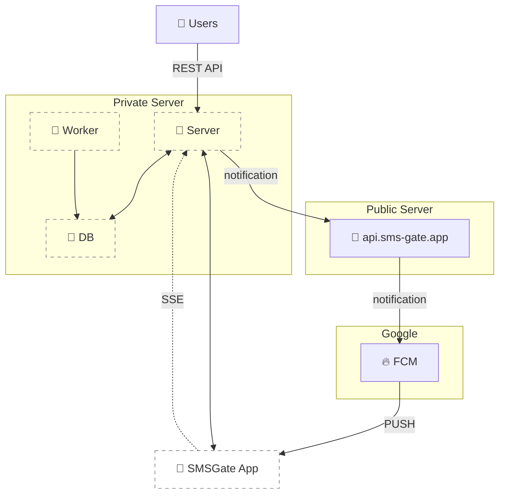
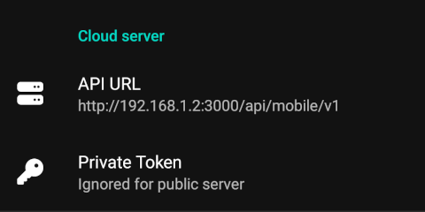

# 🚀 Getting Started

## 🔒 Private Server

To enhance privacy and control, you can host your own private server. This keeps all message data within your infrastructure while maintaining push notification capabilities through our public server at `api.sms-gate.app`. This setup eliminates the need to configure Firebase Cloud Messaging (FCM) or rebuild the Android app, but it does demand some technical know-how.

<center>

```mermaid
flowchart
    %% === MAIN BLOCKS ===
    Users["👥 Users"]
    Android["🤖 SMSGate App"]

    subgraph PrivateServer["Private Server"]
        GoServerPrivate["🐹 Server"]
        GoWorkerPrivate["🐹 Worker"]
        DB["🦭 DB"]

        GoServerPrivate <--> DB
        GoWorkerPrivate --> DB
    end

    subgraph Google["Google"]
        FCM["🔥 FCM"]
    end

    subgraph PublicServer["Public Server"]
        GoServerPublic["🐹 api.sms-gate.app"]
    end

    %% === CONNECTIONS ===
    
    Users -->|REST API| GoServerPrivate
    GoServerPrivate -->|notification| GoServerPublic
    GoServerPublic -->|notification| FCM
    FCM -->|PUSH| Android
    Android <--> GoServerPrivate

    %% === ALTERNATIVE NOTIFICATION PATH ===
    Android -.->|SSE| GoServerPrivate

    %% === STYLING ===
    classDef altConn stroke-dasharray: 5 5,stroke:#888,fill:none;
    class Android,GoServerPrivate,GoWorkerPrivate,DB altConn;
```
</center>

!!! tip "When to Choose Private Mode"
    - 🏢 Enterprise deployments requiring full data control
    - 🔐 Enhanced security compliance needs
    - 📈 Messaging rate exceeds Public Server limit
    - 🌐 Custom integration requirements

### Prerequisites ✅

The easiest way to run the server is to use [Docker](https://www.docker.com/). For alternative installation methods, see [Private Server Documentation](../features/private-server.md#installation-methods).

To run the server, you'll need:

- 🐧 Linux VPS
- 🐳 Docker installed
- 🗄️ MySQL/MariaDB server with empty database and privileged user
- 🔄 Reverse proxy with valid SSL certificate ([project CA](../services/ca.md) supported)

### Run the Server 🖥️

1. **Create configuration**  
    Copy the example config and customize:
    ```sh title="Get config.yml template"
    wget https://raw.githubusercontent.com/android-sms-gateway/server/master/configs/config.example.yml -O config.yml
    ```
    Key sections to edit:
    ```yaml title="Private Server Configuration Example"
    gateway:
        mode: private
        private_token: your-secure-token-here # (1)!
    http:
        listen: 0.0.0.0:3000
    database: # (2)!
        host: localhost
        port: 3306
        user: root
        password: root
        database: sms
        timezone: UTC
    ```
    1. Must match device configuration
    2. Must match MySQL/MariaDB configuration

    !!! important "Configuration Location"
        By default, the application looks for `config.yml` in the current working directory.
        Alternatively, you can set the `CONFIG_PATH` environment variable to specify a custom path to the configuration file.

2. **Launch the server**

    ```sh title="Docker Command"
    docker run -d --name sms-gateway \
        -p 3000:3000 \
        -v $(pwd)/config.yml:/app/config.yml \
        ghcr.io/android-sms-gateway/server:latest
    ```
        
3. **Run the background worker (optional)**

    ```sh title="Docker Command"
    docker run -d --name sms-gateway-worker \
        -v $(pwd)/config.yml:/app/config.yml \
        ghcr.io/android-sms-gateway/server:latest \
        /app/app worker
    ```

    The background worker handles maintenance tasks. See [Background Worker](../features/private-server.md#background-worker) for setup details.

4. **Configure reverse proxy**
    
    ```nginx title="Example Nginx Config"
    location / {
        proxy_pass http://localhost:3000;
        proxy_set_header Host $host;
        proxy_set_header X-Forwarded-For $remote_addr;
    }
    ```

    See [`Reverse Proxy Configuration`](../features/private-server.md#reverse-proxy-configuration) for setup details and advanced options.

!!! success "Verification"
    Test server accessibility:
    ```sh title="Health Check Verification"
    curl https://private.example.com/health
    # Should return JSON health status
    ```

### Configure Android App 📱

<figure markdown>
   { width="400" align=center }
   <figcaption>Android app configuration for private mode</figcaption>
</figure>

!!! danger "Important"
    Changing servers will **reset credentials** and require device re-registration!

1. **Access Settings**  
    Navigate to **Settings** tab → **Cloud Server**

2. **Enter server details**  
    ```text
    API URL: https://private.example.com/api/mobile/v1
    Private Token: your-secure-token-here
    ```
    
    !!! note "API URL Path"
         The API URL **must** include the `/api/mobile/v1` path. Using just the base URL (e.g., `https://private.example.com`) will not work.

    !!! warning "HTTPS Required"
         The Android app **requires HTTPS** for all communications with your private server unless you use an insecure build variant. Using HTTP will result in connection failures.
         
         To obtain a valid SSL certificate:
         
         - Use [Let's Encrypt](https://letsencrypt.org/) for a free, trusted certificate
         - Use our [project CA](../services/ca.md) for private IP addresses or internal domains
         - Use a tunneling service like [ngrok](https://ngrok.com/) or [Cloudflare Tunnel](https://www.cloudflare.com/products/tunnel/) for testing

3. **Activate connection**  
    1. Switch to **Home** tab
    2. Activate **Cloud server** switch
    3. **Tap the "Offline" button** to initiate the connection and registration process
    4. Wait for the app to establish connection (button will change to "Online")

!!! success "Successful Connection"
     After successful connection, credentials will be **automatically generated** and appear in the **Cloud Server** section:
    ```text
    Username: A1B2C3
    Password:  z9y8x7...
    ```

!!! info "Automatic Registration"
    No manual registration step is required. Username and password are generated automatically on the first successful connection to the server.

### Using the API 📡

All API interactions with the SMSGate use the same request format and authentication methods, but the URL structure differs between Cloud and Private server modes.

#### URL Structure Comparison

| Component    | Cloud Server                                    | Private Server                                     |
| ------------ | ----------------------------------------------- | -------------------------------------------------- |
| Base URL     | `https://api.sms-gate.app`                      | `https://your-domain.com`                          |
| API Path     | `/3rdparty/v1/...`                              | `/api/3rdparty/v1/...`                             |
| Full Example | `https://api.sms-gate.app/3rdparty/v1/messages` | `https://your-domain.com/api/3rdparty/v1/messages` |

!!! note "Why the Difference?"
    The cloud server uses URL rewriting where the domain `api.sms-gate.app` already contains the `api` part. With a private server, you need to explicitly include `/api` in the URL path.

#### Example: Sending a Message

```bash
# Cloud Server
curl -X POST "https://api.sms-gate.app/3rdparty/v1/messages" \
  -u "username:password" \
  -H "Content-Type: application/json" \
  -d '{"phoneNumbers": ["+1234567890"], "textMessage": {"text": "Hello"}}'

# Private Server
curl -X POST "https://your-domain.com/api/3rdparty/v1/messages" \
  -u "username:password" \
  -H "Content-Type: application/json" \
  -d '{"phoneNumbers": ["+1234567890"], "textMessage": {"text": "Hello"}}'
```

---


## 📚 See Also

- [Private Server Documentation](../features/private-server.md)
- [Ubuntu/Docker/Nginx Setup Guide](https://github.com/capcom6/android-sms-gateway/discussions/50)
- [Docker Compose Quickstart](https://github.com/android-sms-gateway/server/tree/master/deployments/docker-compose-proxy)
