# Getting Started 🚀

## Private Server 🔒

To enhance privacy and control, you can host your own private server. This keeps all message data within your infrastructure while maintaining push notification capabilities through our public server at `api.sms-gate.app`. This setup eliminates the need to configure Firebase Cloud Messaging (FCM) or rebuild the Android app, but it does demand some technical know-how.

```mermaid
flowchart
    %% === MAIN BLOCKS ===
    Users["👥 Users"]
    Android["🤖 SMSGate App"]

    subgraph PrivateServer["Private Server"]
        GoServerPrivate["🐹 Server"]
        GoWorkerPrivate["🐹 Worker"]
        DB["🦭 DB"]

        GoServerPrivate <--> DB
        GoWorkerPrivate --> DB
    end

    subgraph Google["Google"]
        FCM["🔥 FCM"]
    end

    subgraph PublicServer["Public Server"]
        GoServerPublic["🐹 api.sms-gate.app"]
    end

    %% === CONNECTIONS ===
    
    Users -->|REST API| GoServerPrivate
    GoServerPrivate -->|notification| GoServerPublic
    GoServerPublic -->|notification| FCM
    FCM -->|PUSH| Android
    Android <--> GoServerPrivate

    %% === ALTERNATIVE NOTIFICATION PATH ===
    Android -.->|SSE| GoServerPrivate

    %% === STYLING ===
    classDef altConn stroke-dasharray: 5 5,stroke:#888,fill:none;
    class Android,GoServerPrivate,GoWorkerPrivate,DB altConn;
```

<center>

</center>

!!! tip "When to Choose Private Mode"
    - 🏢 Enterprise deployments requiring full data control
    - 🔐 Enhanced security compliance needs
    - 📈 Messaging rate exceeds Public Server limit
    - 🌐 Custom integration requirements

### Prerequisites ✅

The easiest way to run the server is to use [Docker](https://www.docker.com/). For alternative installation methods, see [Private Server Documentation](../features/private-server.md#installation-methods).

To run the server, you'll need:

- 🐧 Linux VPS
- 🐳 Docker installed
- 🗄️ MySQL/MariaDB server with empty database and privileged user
- 🔄 Reverse proxy with valid SSL certificate ([project CA](../services/ca.md) supported)

### Run the Server 🖥️

1. **Create configuration**  
    Copy the example config and customize:
    ```sh title="Get config.yml template"
    wget https://raw.githubusercontent.com/android-sms-gateway/server/master/configs/config.example.yml -O config.yml
    ```
    Key sections to edit:
    ```yaml title="Private Server Configuration Example"
    gateway:
        mode: private
        private_token: your-secure-token-here # (1)!
    http:
        listen: 0.0.0.0:3000
    database: # (2)!
        host: localhost
        port: 3306
        user: root
        password: root
        database: sms
        timezone: UTC
    ```
    1. Must match device configuration
    2. Must match MySQL/MariaDB configuration

    !!! important "Configuration Location"
        By default, the application looks for `config.yml` in the current working directory.
        Alternatively, you can set the `CONFIG_PATH` environment variable to specify a custom path to the configuration file.

2. **Launch the server**

    ```sh title="Docker Command"
    docker run -d --name sms-gateway \
        -p 3000:3000 \
        -v $(pwd)/config.yml:/app/config.yml \
        ghcr.io/android-sms-gateway/server:latest
    ```
        
3. **Run the background worker (optional)**

    ```sh title="Docker Command"
    docker run -d --name sms-gateway-worker \
        -v $(pwd)/config.yml:/app/config.yml \
        ghcr.io/android-sms-gateway/server:latest \
        /app/app worker
    ```

    The background worker handles maintenance tasks. See [Background Worker](../features/private-server.md#background-worker) for setup details.

4. **Configure reverse proxy**
    
    ```nginx title="Example Nginx Config"
    location / {
        proxy_pass http://localhost:3000;
        proxy_set_header Host $host;
        proxy_set_header X-Forwarded-For $remote_addr;
    }
    ```

    See [`Reverse Proxy Configuration`](../features/private-server.md#reverse-proxy-configuration) for setup details and advanced options.

!!! success "Verification"
    Test server accessibility:
    ```sh title="Health Check Verification"
    curl https://private.example.com/health
    # Should return JSON health status
    ```

### Configure Android App 📱

<figure markdown>
   { width="400" align=center }
   <figcaption>Android app configuration for private mode</figcaption>
</figure>

!!! danger "Important"
    Changing servers will **reset credentials** and require device re-registration!

1. **Access Settings**  
    Navigate to **Settings** tab → **Cloud Server**

2. **Enter server details**  
    ```text
    API URL: https://private.example.com/api/mobile/v1
    Private Token: your-secure-token-here
    ```

3. **Activate connection**  
    1. Switch to **Home** tab
    2. Activate **Cloud server** switch
    3. Restart the app using the bottom button

!!! success "Successful Connection"
    New credentials will appear in **Cloud Server** section when configured properly:
    ```text
    Username: A1B2C3
    Password:  z9y8x7...
    ```

### Password Management 🔑

Identical to [Cloud Server mode](public-cloud-server.md#password-management).

---


## See Also 📚

- [Private Server Documentation](../features/private-server.md)
- [Ubuntu/Docker/Nginx Setup Guide](https://github.com/capcom6/android-sms-gateway/discussions/50)
- [Docker Compose Quickstart](https://github.com/android-sms-gateway/server/tree/master/deployments/docker-compose-proxy)
