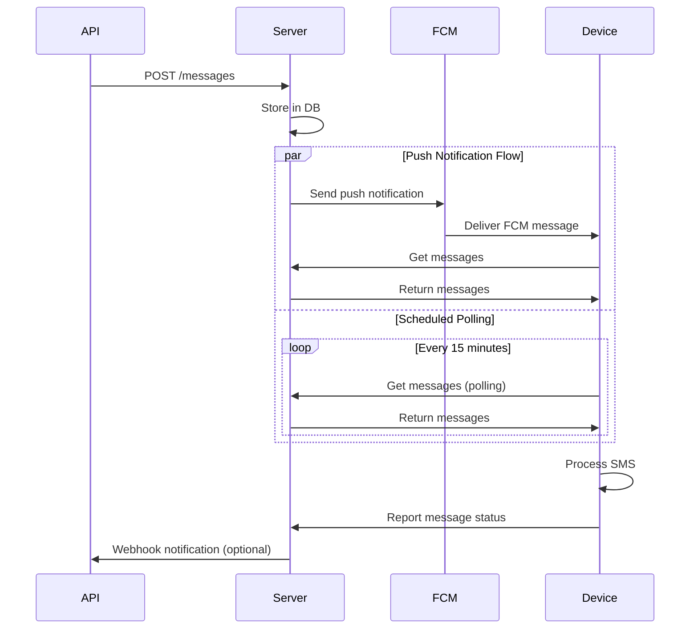

# Getting Started 🚀

## Cloud Server ☁️

Use Cloud Server mode when your device has dynamic or shared IP addresses. Start immediately—no registration, email, or phone number required.

### Key Features ⚡

- 🌐 No registration required
- 🔄 Hybrid push-pull architecture
- ⏱️ Dynamic and shared device IP support
- 🔒 Basic authentication

### Requirements ⚠️
- Requires Google Play Services for push notifications
- Needs active internet connection

### Message Flow 📨



=== "🔔 Push Notification"
    ```mermaid
    graph LR
        A[API Request] --> B[Server]
        B --> C[FCM]
        C --> D[Device]
        D --> E[Retrieve Messages]
    ```

    - Instant delivery via Firebase
    - Primary message channel

=== "⏰ Scheduled Polling"
    ```mermaid
    graph LR
        A[Device] --> B{Every 15min}
        B --> C[Check Server]
        C --> D[Get Messages]
    ```

    - Fallback mechanism
    - Ensures message delivery

=== "📡 Custom Ping"
    <center>
    
    </center>

    - Configurable check interval
    - May increase battery consumption

### How to Use 🛠️

1. **Activate Cloud Mode**  
   Launch app → Toggle "Cloud Server"

2. **Go Online**  
   Tap the "Offline" button → Becomes "Online"
   
3. **Get Credentials**  
   They will be generated by the server.
   <center>
      
   </center>

   

4. **Send Message**  
   
    === "cURL"
        ```bash
        curl -X POST -u "username:password" \
         --json '{"textMessage":{"text":"Hello World"},"phoneNumbers":["+19162255887"]}' \
         https://api.sms-gate.app/3rdparty/v1/messages
        ```

    === "Python"
        ```python
        import requests
        
        response = requests.post(
            "https://api.sms-gate.app/3rdparty/v1/messages",
            auth=("username", "password"),
            json={
                "textMessage": { "text": "Hello World"},
                "phoneNumbers": ["+19162255887"]
            }
        )
        ```

    === "JavaScript"
        ```javascript
        fetch('https://api.sms-gate.app/3rdparty/v1/messages', {
          method: 'POST',
          headers: {
            'Authorization': 'Basic ' + btoa('username:password'),
            'Content-Type': 'application/json'
          },
          body: JSON.stringify({
            textMessage: { text: "Hello World" },
            phoneNumbers: ["+79990001234"]
          })
        });
        ```

#### Password Management 🔐

!!! danger "Security Requirements"
    - :material-form-textbox-password: Minimum 14 characters
    - :material-text: No reuse of previous passwords is recommended
    - :material-clock-alert: Changes take immediate effect

**Update Steps**:

1. :gear: Settings → Cloud Server
2. :material-key: Credentials → Password
3. :material-form-textbox-password: Enter new password
4. :material-check: Confirm changes

---

[:material-book-open: Full API Documentation](https://capcom6.github.io/android-sms-gateway)
