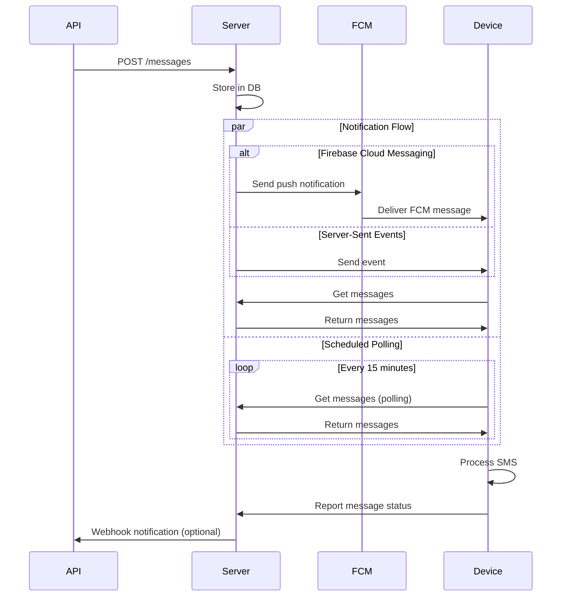

# Getting Started 🚀

## Cloud Server ☁️

Use Cloud Server mode when your device has dynamic or shared IP addresses. Start immediately—no registration, email, or phone number required.

### Key Features ⚡

- 🌐 No registration required
- 🔄 Hybrid push-pull architecture
- ⏱️ Dynamic and shared device IP support
- 🔒 Basic authentication

### Requirements ⚠️
- Requires Google Play Services for Firebase Cloud Messaging (FCM) push notifications
- Provides a Server-Sent Events (SSE) fallback for devices without Play Services
- Needs active internet connection

### Message Flow 📨


```mermaid
sequenceDiagram
    participant API
    participant Server
    participant FCM
    participant Device
    
    API->>Server: POST /messages
    Server->>Server: Store in DB
    par Notification Flow
        alt Firebase Cloud Messaging
            Server->>FCM: Send push notification
            FCM->>Device: Deliver FCM message
        else Server-Sent Events
            Server->>Device: Send event
        end
        Device->>Server: Get messages
        Server->>Device: Return messages
    and Scheduled Polling
        loop Every 15 minutes
            Device->>Server: Get messages (polling)
            Server->>Device: Return messages
        end
    end
    
    Device->>Device: Process SMS
    Device->>Server: Report message status
    Server->>API: Webhook notification (optional)
```

=== "🔔 Push Notification"
    ```mermaid
    graph LR
        A[API Request] --> B[Server]
        B --> C[FCM]
        C --> D[Device]
        D --> E[Retrieve Messages]
    ```

    - Instant delivery via Firebase
    - Primary message channel

=== "📡 SSE Fallback"
    ```mermaid
    graph LR
        A[API Request] --> B[Server]
        B -->|SSE connection| C[Device]
        C --> D[Retrieve Messages]
    ```

    - Fallback when FCM is unavailable
    - Persistent connection for real-time events
    - Shows persistent notification on device during operation
    - May increase battery consumption due to the long-lived connection

=== "⏰ Scheduled Polling"
    ```mermaid
    graph LR
        A[Device] --> B{Every 15min}
        B --> C[Check Server]
        C --> D[Get Messages]
    ```

    - Fallback mechanism
    - Ensures message delivery

=== ":ping_pong: Custom Ping"
    <center>
    
    </center>

    - Configurable check interval
    - May increase battery consumption

#### Notification Channel Selection 🔔

The app allows you to control which notification channel is used:

| Mode         | Description                                          |
| ------------ | ---------------------------------------------------- |
| **Auto**     | Uses FCM when available, falls back to SSE (default) |
| **SSE Only** | Forces Server-Sent Events, bypassing FCM entirely    |

**When to use SSE Only:**

- :building_construction: **Enterprise environments** where FCM is restricted by firewall policies
- :no_mobile_phones: **Devices without Google Play Services** (e.g., Chinese devices, custom ROMs)
- :lock: **Privacy-focused** deployments wanting to avoid Google services
- :wrench: **Testing** SSE functionality

**Configuration:**

Change the notification channel in the app settings:

1. Navigate to **Settings** → **Cloud Server**
2. Find **Notification Channel** option
3. Select **Auto** or **SSE Only**
4. Restart the app to apply changes

**Important:** SSE Only mode maintains a persistent HTTP connection, which may increase battery consumption and shows a persistent notification in the status bar.

### How to Use 🛠️

1. **Activate Cloud Mode**
   Launch app → Toggle "Cloud Server"

2. **Go Online**
   Tap the "Offline" button to initiate connection and registration process → Button will change to "Online" when connected
    
3. **Get Credentials**
    Credentials will be **automatically generated** and appear in the **Cloud Server** section after successful connection:
   <center>
      
   </center>
    !!! info "Automatic Registration"
        No manual registration step is required. Username and password are generated automatically on the first successful connection to the server.

   

4. **Send Message**  
   
    === "cURL"
        ```bash
        curl -X POST -u "username:password" \
         --json '{"textMessage":{"text":"Hello World"},"phoneNumbers":["+19162255887"]}' \
         https://api.sms-gate.app/3rdparty/v1/messages
        ```

    === "Python"
        ```python
        import requests
        
        response = requests.post(
            "https://api.sms-gate.app/3rdparty/v1/messages",
            auth=("username", "password"),
            json={
                "textMessage": { "text": "Hello World"},
                "phoneNumbers": ["+19162255887"]
            }
        )
        ```

    === "JavaScript"
        ```javascript
        fetch('https://api.sms-gate.app/3rdparty/v1/messages', {
          method: 'POST',
          headers: {
            'Authorization': 'Basic ' + btoa('username:password'),
            'Content-Type': 'application/json'
          },
          body: JSON.stringify({
            textMessage: { text: "Hello World" },
            phoneNumbers: ["+79990001234"]
          })
        });
        ```

#### Password Management 🔐

!!! danger "Security Requirements"
    - :material-form-textbox-password: Minimum 14 characters
    - :material-text: No reuse of previous passwords is recommended
    - :material-clock-alert: Changes take immediate effect

**Update Steps**:

1. :gear: Settings → Cloud Server
2. :material-key: Credentials → Password
3. :material-form-textbox-password: Enter new password
4. :material-check: Confirm changes

---

[:material-book-open: Full API Documentation](https://api.sms-gate.app/)
