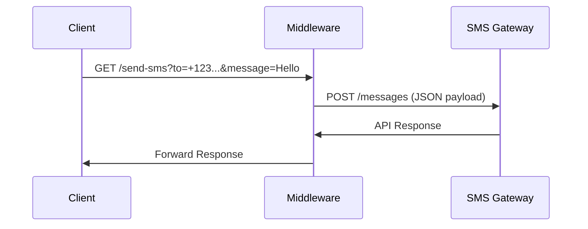

# Integration - GET to POST 🔄

Many systems allow only GET requests with URL parameters. Since SMSGate requires POST requests with JSON payloads, you'll need middleware to convert between these formats.



## Examples 🛠️

Convert GET requests to SMS Gateway's required POST format using these middleware examples. Deploy to handle requests like: `https://your-server.com/send-sms?to=+1234567890&message=Hello%20World`

=== ":material-language-python: Python Flask"
    ```python
    import os

    from flask import Flask, request, jsonify, Response
    import requests
    from requests.auth import HTTPBasicAuth

    app = Flask(__name__)

    SMS_API_USERNAME = os.environ.get('SMS_API_USERNAME')
    SMS_API_PASSWORD = os.environ.get('SMS_API_PASSWORD')

    @app.route('/send-sms', methods=['GET'])
    def send_sms():
        # Extract query parameters
        to_phone = request.args.get('to')
        message = request.args.get('message')

        # Validate required parameters
        missing = []
        if not to_phone:
            missing.append('to')
        if not message:
            missing.append('message')
        
        if missing:
            return jsonify(error=f'Missing parameters: {", ".join(missing)}'), 400

        # Prepare request to SMS gateway
        target_url = 'https://api.sms-gate.app/3rdparty/v1/messages'
        headers = {'Content-Type': 'application/json'}
        payload = {
            'message': message,
            'phoneNumbers': [to_phone]
        }

        try:
            auth = HTTPBasicAuth(SMS_API_USERNAME, SMS_API_PASSWORD)
            
            response = requests.post(
                target_url,
                auth=auth,
                headers=headers,
                json=payload
            )

            # Forward response
            return Response(
                response=response.text,
                status=response.status_code,
                content_type=response.headers.get('Content-Type', 'application/json')
            )

        except requests.exceptions.RequestException as e:
            return jsonify(error=f'SMS gateway error: {str(e)}'), 500

    if __name__ == '__main__':
        app.run(host='0.0.0.0', port=5000)
    ```

=== ":material-nodejs: Node.js Express"
    ```javascript
    const express = require('express');
    const axios = require('axios');

    const app = express();
    const port = process.env.PORT || 3000;

    const SMS_API_USERNAME = process.env.SMS_API_USERNAME;
    const SMS_API_PASSWORD = process.env.SMS_API_PASSWORD;

    app.get('/send-sms', async (req, res) => {
        const { to, message } = req.query;
        const missing = [];
        
        if (!to) missing.push('to');
        if (!message) missing.push('message');
        
        if (missing.length) {
            return res.status(400).json({ 
                error: `Missing parameters: ${missing.join(', ')}` 
            });
        }

        const targetUrl = 'https://api.sms-gate.app/3rdparty/v1/messages';
        const headers = { 'Content-Type': 'application/json' };
        const payload = { 
            message: message,
            phoneNumbers: [to]
        };

        try {
            const response = await axios.post(targetUrl, payload, {
                auth: {
                    username: SMS_API_USERNAME,
                    password: SMS_API_PASSWORD
                },
                headers: headers,
                validateStatus: () => true // Forward all status codes
            });

            res.status(response.status)
                .set('Content-Type', response.headers['content-type'])
                .send(response.data);
        } catch (error) {
            res.status(500).json({ 
                error: `SMS gateway error: ${error.message}` 
            });
        }
    });

    app.listen(port, () => {
        console.log(`Server running on port ${port}`);
    });
    ```

=== ":material-aws: Python AWS Lambda"
    ```python
    import json
    import os
    import requests
    from requests.auth import HTTPBasicAuth

    def lambda_handler(event, context):
        # Extract query parameters from the event
        params = event.get('queryStringParameters', {})
        
        # Check for required parameters
        required_params = ['to', 'message']
        missing_params = [param for param in required_params if param not in params]
        
        if missing_params:
            return {
                'statusCode': 400,
                'body': json.dumps({'error': f'Missing parameters: {", ".join(missing_params)}'})
            }
        
        # Collect parameters
        SMS_API_USERNAME = os.environ.get('SMS_API_USERNAME')
        SMS_API_PASSWORD = os.environ.get('SMS_API_PASSWORD')
        to_phone = params['to']
        message_text = params['message']
        
        # Target API endpoint
        target_url = 'https://api.sms-gate.app/3rdparty/v1/messages'
        
        # Prepare headers and data for POST request
        headers = {'Content-Type': 'application/json'}
        auth = HTTPBasicAuth(SMS_API_USERNAME, SMS_API_PASSWORD)
        payload = {
            'message': message_text,
            'phoneNumbers': [to_phone]
        }
        
        try:
            # Send POST request to the target API
            response = requests.post(
                target_url,
                auth=auth,
                headers=headers,
                json=payload
            )
            
            # Return the target API's response to the client
            return {
                'statusCode': response.status_code,
                'body': response.text,
                'headers': {
                    'Content-Type': response.headers.get('Content-Type', 'application/json')
                }
            }
            
        except requests.exceptions.RequestException as e:
            # Handle request exceptions (e.g., network issues)
            return {
                'statusCode': 500,
                'body': json.dumps({'error': f'Failed to send request: {str(e)}'})
            }
    ```

=== ":material-cloud: Cloudflare Workers"
    ```javascript
    export default {
        async fetch(request, env, ctx) {
            try {
            const url = new URL(request.url);
            const params = url.searchParams;

            const SMS_API_USERNAME = env.SMS_API_USERNAME;
            const SMS_API_PASSWORD = env.SMS_API_PASSWORD;
        
            // Validate required parameters
            const requiredParams = ['to', 'message'];
            const missing = requiredParams.filter(param => !params.has(param));
            
            if (missing.length > 0) {
                return new Response(
                    JSON.stringify({ error: `Missing parameters: ${missing.join(', ')}` }), 
                    { status: 400, headers: { 'Content-Type': 'application/json' } }
                );
            }
        
            // Extract parameters
            const [to, message] = requiredParams.map(p => params.get(p));
        
            // Construct target API request
            const targetUrl = 'https://api.sms-gate.app/3rdparty/v1/messages';
            const auth = btoa(`${SMS_API_USERNAME}:${SMS_API_PASSWORD}`);
            
            const response = await fetch(targetUrl, {
                method: 'POST',
                headers: {
                    'Content-Type': 'application/json',
                    'Authorization': `Basic ${auth}`
                },
                body: JSON.stringify({
                    message: message,
                    phoneNumbers: [to]
                })
            });
        
            // Forward response
            return new Response(await response.text(), {
                status: response.status,
                headers: {
                'Content-Type': 'application/json'
                }
            });
        
            } catch (error) {
            return new Response(
                JSON.stringify({ error: `Internal server error: ${error.message}` }), 
                { status: 500, headers: { 'Content-Type': 'application/json' } }
            );
            }
        },
    };
    ```

## Deployment 🚀

=== "Local Server"
    ```bash
    # Python Flask
    export SMS_API_USERNAME="your_username"
    export SMS_API_PASSWORD="your_password"
    python flask_app.py
    ```

=== "Cloud Providers"
    ```bash
    # AWS Lambda Deployment
    pip install requests -t .
    zip -r lambda.zip .
    aws lambda update-function-code --function-name sms-gateway --zip-file fileb://lambda.zip
    ```

=== "Edge Computing"
    ```bash
    # Cloudflare Workers
    wrangler publish
    ```

## Testing 🔍

```bash title="Sample Request"
curl "https://your-api.com/send-sms?to=%2B1234567890&message=Test"
```

```json title="Expected Response"
{
  "id": "abc123",
  "state": "Pending"
}
```

## Security Considerations 🔐

!!! danger "Critical Notes"
    ```diff
    - Examples lack authentication
    - No rate limiting implemented
    - No input validation beyond basic checks
    + Always add production security measures
    ```

**Recommended Additions**:

1. :material-key-chain: API Key authentication
2. :material-speedometer: Rate limiting (e.g., 10 reqs/min)
3. :material-filter: Input validation:
    ```python
    if not to_phone.startswith('+'):
        return invalid_number_error()
    ```
4. :material-shield-check: HTTPS enforcement

---

[:material-book-open: Flask Documentation](https://flask.palletsprojects.com/)  
[:material-aws: Lambda Guide](https://docs.aws.amazon.com/lambda/)  
[:material-cloud: Cloudflare Workers Guide](https://developers.cloudflare.com/workers/)  
