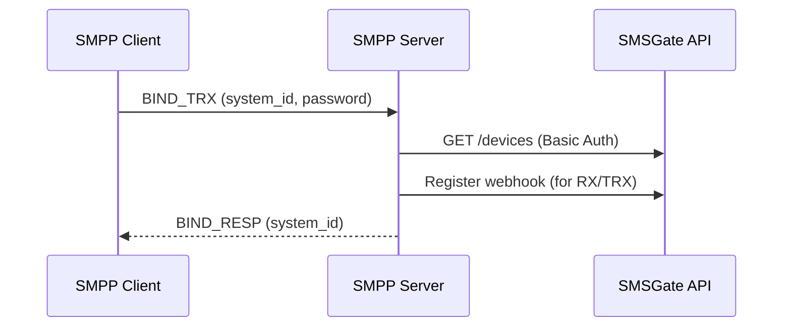
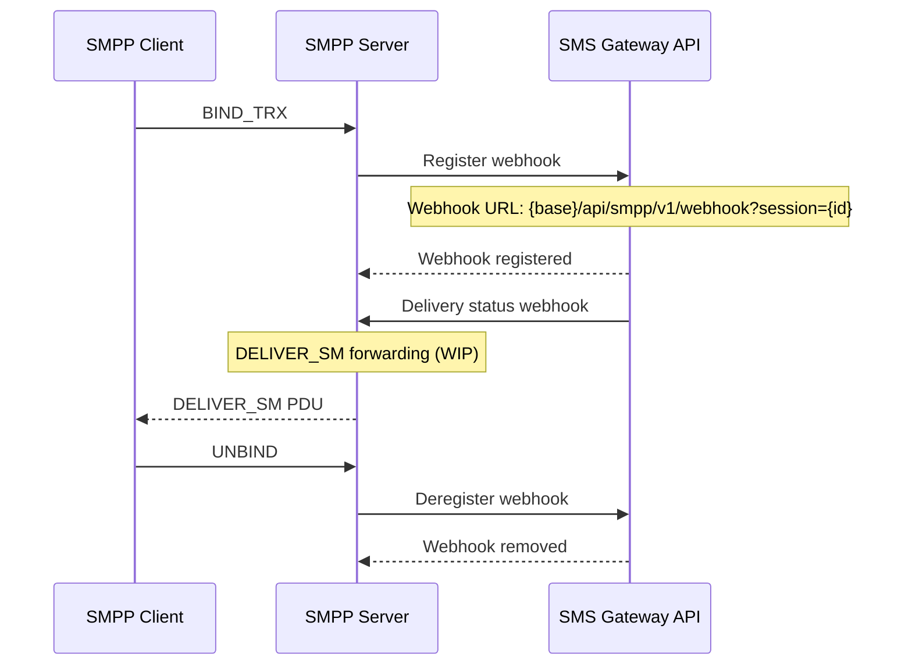

# 📡 SMPP Protocol

The SMSGate supports the SMPP v3.4 protocol through a dedicated SMPP Server component. This guide covers how to integrate with the SMPP Server for sending SMS messages and receiving delivery receipts.

## 📋 Overview

SMPP (Short Message Peer-to-Peer) is a telecommunications industry protocol for exchanging SMS messages between external messaging entities and SMS centers. The SMPP Server bridges SMPP clients with the SMSGate ecosystem, allowing you to use existing SMPP-based infrastructure with Android devices.

<div class="grid cards" markdown>

- **🔌 When to Use SMPP**  
    Use SMPP when you have existing SMPP-based infrastructure, work with SMS aggregators, or need standardized telecom protocol integration.

- **🌐 When to Use REST API**  
    Use the [REST API](./api.md) for simpler integrations, web applications, or when you need direct access to all SMSGate features.

</div>

## 🔌 Connection Details

| Parameter  | Value               |
| ---------- | ------------------- |
| Protocol   | SMPP v3.4           |
| Plain port | 2775                |
| TLS port   | 2776 (SMPPs)        |
| Encoding   | GSM 7-bit (default) |

## 🔑 Authentication

Authentication happens during the SMPP BIND sequence using your SMSGate credentials:

| Field       | Value                            |
| ----------- | -------------------------------- |
| `system_id` | Your SMS Gateway username        |
| `password`  | Your SMS Gateway password        |
| Bind types  | `BIND_TX`, `BIND_RX`, `BIND_TRX` |

### Authentication Flow



## 📤 Sending SMS

Use the `SUBMIT_SM` PDU to send SMS messages. The SMPP Server translates this into an HTTP API call to the SMSGate.

### Parameter Mapping

| SMPP Field            | Gateway Mapping        | Notes                           |
| --------------------- | ---------------------- | ------------------------------- |
| `source_addr`         | Sender (optional)      | Overridden by TON/NPI settings  |
| `destination_addr`    | Recipient phone number | E.164 format recommended        |
| `short_message`       | SMS text content       | GSM 7-bit encoding              |
| `registered_delivery` | Delivery receipt flag  | `0x01` to request receipt       |
| `data_coding`         | Message encoding       | `0x00` = default, `0x08` = UCS2 |

### Example: Submit SMS

```bash title="SUBMIT_SM Example"
# Using an SMPP client library (e.g., go-smpp, pysmpp, jSMPP)
# Connect to SMPP Server and send SUBMIT_SM

source_addr_ton: 0x01        # International
source_addr_npi: 0x01        # E.164
source_addr: ""              # Empty (uses device default)
dest_addr_ton: 0x01          # International
dest_addr_npi: 0x01          # E.164
destination_addr: "+1234567890"
short_message: "Hello from SMPP!"
registered_delivery: 0x01    # Request delivery receipt
```

## 📊 Querying Status

Use the `QUERY_SM` PDU to check the delivery status of a previously submitted message.

### Message State Mapping

| Gateway State        | SMPP `message_state` | Description                 |
| -------------------- | -------------------- | --------------------------- |
| `pending`            | Scheduled (0)        | Message queued for delivery |
| `processed` / `sent` | Enroute (1)          | Message sent to device      |
| `delivered`          | Delivered (2)        | Successfully delivered      |
| `failed`             | Undeliverable (5)    | Delivery failed             |

### Example: Query Status

```bash title="QUERY_SM Example"
message_id: "msg_abc123"    # From SUBMIT_SM_RESP
source_addr_ton: 0x01
source_addr_npi: 0x01
source_addr: ""
```

## 🔄 Webhook Lifecycle

For `BIND_RECEIVER` and `BIND_TRANSCEIVER` sessions, the SMPP Server manages webhook registration automatically:



## ⚠️ Error Mapping

The SMPP Server maps HTTP API errors to SMPP error codes:

| HTTP Error | SMPP Error Code                | Description                 |
| ---------- | ------------------------------ | --------------------------- |
| 400        | `ESME_RINVBNDSTS` (0x00000004) | Invalid bind state          |
| 401        | `ESME_RBINDFAIL` (0x0000000D)  | Authentication failed       |
| 403        | `ESME_RBINDFAIL` (0x0000000D)  | Forbidden                   |
| 404        | `ESME_RINVDSTADR` (0x00000006) | Invalid destination address |
| 409        | `ESME_RSYSERR` (0x00000008)    | System error                |
| 422        | `ESME_RINVMSG` (0x00000006)    | Invalid message             |
| 429        | `ESME_RTHROTTLED` (0x00000058) | Too many requests           |
| 500        | `ESME_RSYSERR` (0x00000008)    | Internal server error       |
| 502        | `ESME_RSYSERR` (0x00000008)    | Bad gateway                 |
| 503        | `ESME_RSYSERR` (0x00000008)    | Service unavailable         |

!!! note "Error Code Reference"
    The full error mapping covers 36+ SMPP v3.4 error codes. See the [SMPP Server source code](https://github.com/android-sms-gateway/smpp-server) for the complete mapping.

## 📚 See Also

- [SMPP Server Documentation](../services/smpp-server.md)
- [REST API Reference](./api.md)
- [Authentication Guide](./authentication.md)
- [SMPP Server GitHub Repository](https://github.com/android-sms-gateway/smpp-server)
