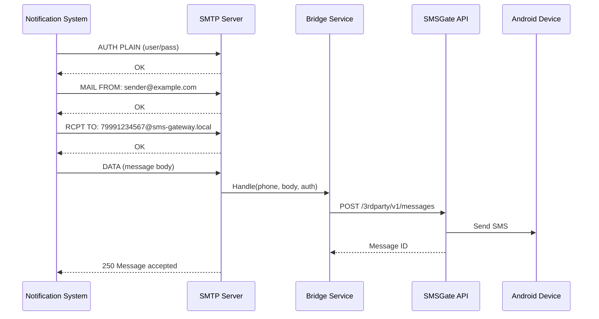

# 📧 Email to SMS Bridge

The Email to SMS Bridge is a standalone SMTP service that receives emails and forwards their content as SMS messages via the SMSGate API. It enables existing email-based notification systems — booking platforms, appointment schedulers, monitoring alerts — to send SMS without code changes.

## 📖 Overview

The bridge acts as an SMTP server that translates incoming emails into SMS messages. Any system that can send email can send SMS through this bridge, with no API integration required.



## 🏗️ Architecture

The Email to SMS Bridge is a standalone Go service with no shared database. It uses Uber FX for dependency injection and communicates with SMSGate via the [client-go SDK](https://github.com/android-sms-gateway/client-go).

<div class="grid cards" markdown>

- **📨 SMTP Server**
    Listens on configurable host:port (default `127.0.0.1:587`) with optional STARTTLS. Supports AUTH PLAIN only.

- **🔗 Bridge Module**
    Validates phone numbers, extracts message bodies, and passes authenticated credentials to the SMSGate client.

- **🌐 SMSGate Client**
    Per-request authenticated HTTP client that sends SMS via the SMSGate 3rd-party API.

- **📊 Health & Metrics Server**
    Built-in HTTP server on port 3000 providing health checks, Prometheus metrics, and Swagger UI.

</div>

## ⚙️ How it Works

### Email Format

| Part        | Format             | Description                                            |
| ----------- | ------------------ | ------------------------------------------------------ |
| **To**      | `{phone}@{domain}` | Phone number in international format as the local part |
| **Subject** | (ignored)          | Not used in the SMS                                    |
| **Body**    | Plain text         | The SMS message content                                |
| **Auth**    | AUTH PLAIN         | Username/password are passed through to SMSGate API    |

### Authentication Flow

1. Client connects to the SMTP server and sends `AUTH PLAIN` with SMSGate credentials
2. Credentials are stored for the session and passed directly to the SMSGate API
3. On 401/403 response from SMSGate, the bridge returns SMTP code 535
4. No shared API key — each email sender authenticates individually

## 🚀 Getting Started

### ⚙️ Prerequisites

- An SMSGate account with a connected Android device
- SMTP client (any email-sending system)
- Optional: Docker for containerized deployment

### 📦 Installation

#### Option A: Pre-built Binary

Download the latest release binary from [GitHub Releases](https://github.com/android-sms-gateway/email-to-sms/releases/latest):

```bash title="Download Release Binary"
curl -LO https://github.com/android-sms-gateway/email-to-sms/releases/latest/download/email-to-sms_Linux_x86_64.tar.gz
tar -xzf email-to-sms_Linux_x86_64.tar.gz
SMTP__DOMAIN=sms-gateway.local ./email-to-sms
```

#### Option B: Docker

Pull and run the Docker image from GitHub Container Registry:

```bash title="Run Docker Container"
docker run \
  -e SMTP__DOMAIN=sms-gateway.local \
  -e SMTP__PORT=2525 \
  -p 2525:2525 \
  -p 3000:3000 \
  ghcr.io/android-sms-gateway/email-to-sms:latest
```

#### Option C: Build from Source

```bash title="Build from Source"
git clone https://github.com/android-sms-gateway/email-to-sms.git
cd email-to-sms
make build
./bin/email-to-sms
```

!!! note "Build Requirement"
    Requires **Go 1.25+** to build from source.

## ⚙️ Configuration

Configuration is loaded via environment variables or an optional YAML file specified by `CONFIG_PATH`. Environment variables take precedence over the YAML file.

### Environment Variables

| Env Var                          | Default                                | Description                                       |
| -------------------------------- | -------------------------------------- | ------------------------------------------------- |
| **HTTP**                         |                                        |                                                   |
| `HTTP__ADDRESS`                  | `127.0.0.1:3000`                       | HTTP API bind address (health, metrics, Swagger)  |
| `HTTP__OPENAPI__ENABLED`         | `true`                                 | Enable Swagger UI at `/api/v1/docs`               |
| **SMTP**                         |                                        |                                                   |
| `SMTP__HOST`                     | `127.0.0.1`                            | SMTP server bind address                          |
| `SMTP__PORT`                     | `587`                                  | SMTP server port                                  |
| `SMTP__DOMAIN`                   | `example.com`                          | Allowed recipient email domain (case-insensitive) |
| `SMTP__TLS_CERT`                 | *(empty)*                              | TLS certificate file path (enables STARTTLS)      |
| `SMTP__TLS_KEY`                  | *(empty)*                              | TLS private key file path                         |
| **SMSGate**                      |                                        |                                                   |
| `SMSGATE__URL`                   | `https://api.sms-gate.app/3rdparty/v1` | SMSGate API base URL                              |
| `SMSGATE__SKIP_PHONE_VALIDATION` | `false`                                | Skip phone number validation on the API side      |
| **Special**                      |                                        |                                                   |
| `CONFIG_PATH`                    | *(empty)*                              | Path to optional YAML config file                 |

### Example YAML Config

```yaml title="config.yaml"
smtp:
  host: "0.0.0.0"
  port: 25
  domain: "sms-gateway.local"

smsgate:
  url: "https://api.sms-gate.app/3rdparty/v1"
  skip_phone_validation: false
```

## 🔒 TLS / STARTTLS

TLS is disabled by default. To enable encrypted SMTP connections, provide certificate and key paths:

```bash title="Enable STARTTLS"
docker run \
  -p 587:587 \
  -p 3000:3000 \
  -v /path/to/certs:/certs:ro \
  -e SMTP__HOST=0.0.0.0 \
  -e SMTP__PORT=587 \
  -e SMTP__DOMAIN=sms-gateway.local \
  -e SMTP__TLS_CERT=/certs/server.crt \
  -e SMTP__TLS_KEY=/certs/server.key \
  ghcr.io/android-sms-gateway/email-to-sms:latest
```

!!! tip "TLS Certificates"
    You can use the [Certificate Authority service](./ca.md) to generate SSL certificates for private IP addresses.

## 🔐 Authentication

The bridge uses SMTP AUTH PLAIN with credentials that are passed through to the SMSGate API:

| Step                      | Description                                                  |
| ------------------------- | ------------------------------------------------------------ |
| **1. SMTP AUTH**          | Client sends `AUTH PLAIN` with SMSGate username and password |
| **2. Credential storage** | Credentials held in the SMTP session                         |
| **3. API call**           | Credentials used to authenticate each SMSGate API request    |
| **4. Auth failure**       | On 401/403, bridge returns SMTP code 535 to the client       |

!!! important "TLS Recommended for Production"
    The bridge allows AUTH PLAIN without TLS. For production use, configure TLS to protect credentials in transit.

## 📊 Monitoring

Prometheus metrics are exposed at `/metrics` on the HTTP server (port 3000):

### Bridge Metrics

| Metric                                   | Type    | Description                              |
| ---------------------------------------- | ------- | ---------------------------------------- |
| `email2sms_bridge_emails_received_total` | Counter | Total emails received by the SMTP server |
| `email2sms_bridge_sms_sent_total`        | Counter | Successful SMS sends                     |
| `email2sms_bridge_sms_failed_total`      | Counter | Failed SMS sends                         |

### SMSGate Metrics

| Metric                                  | Type    | Description                      |
| --------------------------------------- | ------- | -------------------------------- |
| `email2sms_smsgate_sms_sent_total`      | Counter | Successful SMS sends (API level) |
| `email2sms_smsgate_sms_failed_total`    | Counter | Failed SMS sends (API level)     |
| `email2sms_smsgate_auth_failures_total` | Counter | SMSGate authentication failures  |

## ❌ SMTP Error Response Codes

| Condition                      | SMTP Code | Message                            |
| ------------------------------ | --------- | ---------------------------------- |
| Success                        | 250       | Message accepted                   |
| Invalid email format           | 550       | Invalid recipient format           |
| Domain mismatch                | 550       | Invalid recipient domain           |
| Invalid phone number           | 550       | Invalid phone number format        |
| Empty message body             | 550       | Message body is empty              |
| SMSGate auth failure (401/403) | 535       | Authentication failed              |
| SMSGate client error (4xx)     | 450       | Temporary failure, try again later |
| SMSGate server error (5xx)     | 550       | Message delivery failed            |
| SMSGate timeout                | 451       | Timeout                            |

!!! note "No Retry Policy"
    The bridge returns errors immediately to the SMTP client. The sending email system is responsible for retries.

## 🚀 Deployment

### Docker Compose Example

```yaml title="docker-compose.yml"
services:
  email-to-sms:
    image: ghcr.io/android-sms-gateway/email-to-sms:latest
    ports:
      - "587:587"
      - "3000:3000"
    environment:
      - SMTP__HOST=0.0.0.0
      - SMTP__PORT=587
      - SMTP__DOMAIN=sms-gateway.local
      - SMSGATE__URL=https://api.sms-gate.app/3rdparty/v1
    restart: unless-stopped
```

## 📚 See Also

- [SMSGate API Reference](../integration/api.md)
- [Authentication Guide](../integration/authentication.md)
- [SMSGate GitHub Organization](https://github.com/android-sms-gateway)
- [Email to SMS Repository](https://github.com/android-sms-gateway/email-to-sms)
