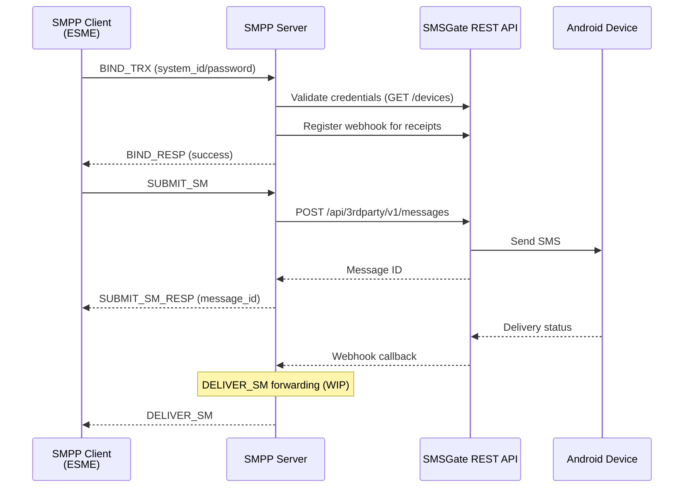

# 📡 SMPP Server

The SMPP Server is a standalone SMPP v3.4 protocol service that bridges SMPP-compatible clients (SMS aggregators, messaging platforms) with the SMSGate ecosystem. It enables external systems to submit SMS messages and receive delivery receipts using the industry-standard SMPP protocol.

## 📖 Overview

The SMPP Server acts as a bridge between SMPP clients and the SMSGate REST API. It translates SMPP protocol operations into HTTP API calls, allowing existing SMPP-based infrastructure to work seamlessly with Android devices running the SMS Gateway app.



## 🏗️ Architecture

The SMPP Server is a standalone Go service with no shared database. All communication with the SMS Gateway happens via the REST API using the [client-go SDK](https://github.com/android-sms-gateway/client-go).

<div class="grid cards" markdown>

- **🔌 SMPP Listener**  
    Listens on port 2775 (plain SMPP) and optionally port 2776 (SMPPs/TLS) for incoming connections.

- **👤 Sessions Manager**  
    Manages SMPP session state machines with thread-safe PDU routing and state transitions.

- **🌐 HTTP Gateway Client**  
    Per-session authenticated HTTP client with automatic webhook registration for delivery receipts.

- **📊 Health & Metrics Server**  
    Built-in HTTP server on port 3000 providing health checks, Prometheus metrics, and OpenAPI documentation.

</div>

## ☁️ Public SMPP Server

A public SMPP server is available at **`smpp.sms-gate.app`** — no installation or self-hosting required. Connect directly using your SMSGate credentials.

| Detail         | Value                                  |
| -------------- | -------------------------------------- |
| Host           | `smpp.sms-gate.app`                    |
| Plain port     | 2775                                   |
| TLS port       | 2776 (Let's Encrypt)                   |
| Authentication | SMSGate username / password            |
| Gateway API    | `https://api.sms-gate.app/3rdparty/v1` |

### Comparison: Public vs Self-Hosted

| Aspect            | Public Server (`smpp.sms-gate.app`) | Self-Hosted                      |
| ----------------- | ----------------------------------- | -------------------------------- |
| Setup             | None — connect directly             | Requires Docker, VPS, or binary  |
| TLS               | Automatic (Let's Encrypt)           | Manual certificate configuration |
| Webhook callbacks | Automatically configured            | Requires a public URL            |
| Rate limiting     | Shared instance limits              | Full control                     |
| Configuration     | Fixed (managed instance)            | Customizable via env vars        |
| Metrics           | Not publicly exposed                | Full access (port 3000)          |

!!! warning "Test Mode"
    The public SMPP server is currently in **test mode**. It runs a shared instance with default configuration. Please [report issues](https://github.com/android-sms-gateway/smpp-server/issues) on GitHub.

## Self-Hosted Deployment

!!! warning "Non-Affiliated Project"
    The SMPP Server is a separate project and is **not affiliated with, endorsed by, or sponsored by** any SMPP protocol standards body. It is an independent open-source project.

### Option A: Pre-built Binary

Download the latest release binary from [GitHub Releases](https://github.com/android-sms-gateway/smpp-server/releases/latest):

```bash title="Download Release Binary"
curl -LO https://github.com/android-sms-gateway/smpp-server/releases/latest/download/smpp-server_Linux_x86_64.tar.gz
tar -xzf smpp-server_Linux_x86_64.tar.gz
./smpp-server
```

### Option B: Docker

Pull and run the Docker image from GitHub Container Registry:

```bash title="Run Docker Container"
docker run \
  -p 2775:2775 \
  -e SMPP__BIND_ADDRESS=0.0.0.0:2775 \
  -e GATEWAY__API_BASE_URL=https://api.sms-gate.app/3rdparty/v1 \
  -e GATEWAY__WEBHOOK_BASE_URL=https://your-public-url \
  ghcr.io/android-sms-gateway/smpp-server:latest
```

### Option C: Build from Source

```bash title="Build from Source"
git clone https://github.com/android-sms-gateway/smpp-server.git
cd smpp-server
go build -o smpp-server .
./smpp-server
```

!!! note "Build Requirement"
    Requires **Go 1.25+** to build from source.

## ⚙️ Configuration

Configuration is loaded via environment variables or a `.env` file. An optional YAML config file can be specified via the `CONFIG_PATH` environment variable.

| Config Key                 | Env Var                     | Default                                | Description                                                          |
| -------------------------- | --------------------------- | -------------------------------------- | -------------------------------------------------------------------- |
| `http.address`             | `HTTP__ADDRESS`             | `127.0.0.1:3000`                       | HTTP API bind address (health, metrics, OpenAPI)                     |
| `smpp.bind_address`        | `SMPP__BIND_ADDRESS`        | `127.0.0.1:2775`                       | SMPP server bind address                                             |
| `smpp.tls_cert`            | `SMPP__TLS_CERT`            | *(empty)*                              | TLS certificate file path (enables SMPPs on port 2776)               |
| `smpp.tls_key`             | `SMPP__TLS_KEY`             | *(empty)*                              | TLS private key file path                                            |
| `gateway.api_base_url`     | `GATEWAY__API_BASE_URL`     | `https://api.sms-gate.app/3rdparty/v1` | SMSGate REST API base URL                                            |
| `gateway.webhook_base_url` | `GATEWAY__WEBHOOK_BASE_URL` | *(empty)*                              | **Required** for delivery receipts: public URL for webhook callbacks |
| `gateway.timeout`          | `GATEWAY__TIMEOUT`          | `60s`                                  | HTTP client timeout for gateway requests                             |

!!! important "Webhook URL Requirement"
    The `GATEWAY__WEBHOOK_BASE_URL` must be publicly reachable by the SMSGate for delivery receipt webhooks to work. The webhook URL follows the pattern: `{GATEWAY_WEBHOOK_BASE_URL}/api/smpp/v1/webhook?session={session_id}`

## 🔐 Authentication

SMPP clients authenticate using their SMSGate credentials via the BIND sequence:

| Bind Type          | PDU        | Description                              |
| ------------------ | ---------- | ---------------------------------------- |
| `BIND_TRANSMITTER` | `BIND_TX`  | Send-only session (submit SMS)           |
| `BIND_RECEIVER`    | `BIND_RX`  | Receive-only session (delivery receipts) |
| `BIND_TRANSCEIVER` | `BIND_TRX` | Bidirectional session (send + receive)   |

The authentication flow:

1. Client sends a BIND PDU with `system_id` (SMSGate username) and `password`
2. SMPP Server validates credentials against the SMSGate REST API
3. On success, the session is established and the client can send/receive PDUs
4. For **RECEIVER** and **TRANSCEIVER** binds, a dynamic webhook is registered for delivery receipts
5. On **UNBIND**, the webhook is deregistered and the session is cleaned up

!!! tip "Recommended Bind Type"
    Use `BIND_TRANSCEIVER` for most use cases to support both sending and receiving in a single connection.

## 📡 SMPP Operations

### Supported PDUs

| Operation    | PDU              | Description                        |
| ------------ | ---------------- | ---------------------------------- |
| Bind         | `BIND_TX/RX/TRX` | Authenticate and establish session |
| Submit SMS   | `SUBMIT_SM`      | Send SMS via the gateway           |
| Query Status | `QUERY_SM`       | Check message delivery state       |
| Unbind       | `UNBIND`         | Gracefully close session           |
| Keep-Alive   | `ENQUIRE_LINK`   | Maintain connection health         |

### Unsupported PDUs

The following PDUs are recognized but return error responses:

- `DATA_SM` — Not supported
- `CANCEL_SM` — Not supported
- `REPLACE_SM` — Not supported
- `SUBMIT_MULTI` — Not supported

## 🔒 TLS/SMPPs Configuration

To enable encrypted SMPP connections (SMPPs), provide TLS certificate and key paths:

```bash title="Enable TLS/SMPPs"
docker run \
  -p 2776:2776 \
  -v /path/to/certs:/certs:ro \
  -e SMPP__TLS_CERT=/certs/server.crt \
  -e SMPP__TLS_KEY=/certs/server.key \
  -e SMPP__BIND_ADDRESS=0.0.0.0:2776 \
  ghcr.io/android-sms-gateway/smpp-server:latest
```

!!! tip "TLS Certificates"
    You can use the [Certificate Authority service](./ca.md) to generate SSL certificates for private IP addresses.

## 📬 Delivery Receipts

When using `BIND_RECEIVER` or `BIND_TRANSCEIVER`, the SMPP Server automatically:

1. Registers a webhook with the SMSGate upon successful bind
2. Receives delivery status updates via webhook callbacks
3. Maps gateway message states to SMPP `message_state` values

### Message State Mapping

| Gateway State        | SMPP `message_state` | Description                 |
| -------------------- | -------------------- | --------------------------- |
| `pending`            | Scheduled (0)        | Message queued for delivery |
| `processed` / `sent` | Enroute (1)          | Message sent to device      |
| `delivered`          | Delivered (2)        | Successfully delivered      |
| `failed`             | Undeliverable (5)    | Delivery failed             |

!!! warning "Work in Progress"
    Delivery receipt forwarding to the ESME client via `DELIVER_SM` PDUs is currently **work in progress**. The webhook is registered, but the forwarding logic is not yet fully implemented.

## 🚀 Deployment

### Docker Compose Example

```yaml title="docker-compose.yml"
services:
  smpp-server:
    image: ghcr.io/android-sms-gateway/smpp-server:latest
    ports:
      - "2776:2776"
      - "3000:3000"
    environment:
      - SMPP__BIND_ADDRESS=0.0.0.0:2776
      - SMPP__TLS_CERT=/certs/server.crt
      - SMPP__TLS_KEY=/certs/server.key
      - GATEWAY__API_BASE_URL=https://api.sms-gate.app/3rdparty/v1
      - GATEWAY__WEBHOOK_BASE_URL=https://smpp.example.com
      - GATEWAY__TIMEOUT=60s
    volumes:
      - ./certs:/certs:ro
    restart: unless-stopped
```

### Health Check

The built-in health endpoint is available at `GET /health` on the HTTP server (default port 3000):

```bash title="Health Check"
curl http://localhost:3000/health
```

## ⚠️ Known Limitations

| Limitation            | Status          | Description                                     |
| --------------------- | --------------- | ----------------------------------------------- |
| Rate limiting         | Not implemented | No per-client rate limiting                     |
| Multi-part SMS        | Not supported   | No message concatenation                        |
| UCS2 encoding         | Not supported   | No binary/Unicode message support               |
| SubmitMulti           | Not supported   | Single recipient only                           |
| DELIVER_SM forwarding | WIP             | Webhook registered, forwarding not complete     |
| Prometheus metrics    | Planned         | Metrics middleware configured but not finalized |

## 📚 See Also

- [SMPP Protocol Integration](../integration/smpp.md)
- [SMSGate API Reference](../integration/api.md)
- [Certificate Authority](./ca.md)
- [SMPP Server GitHub Repository](https://github.com/android-sms-gateway/smpp-server)
