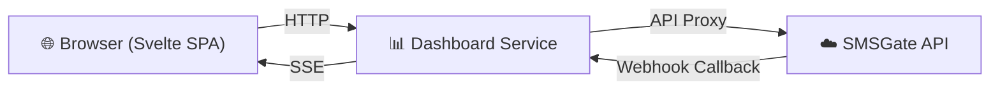

# 📊 Web Dashboard

The SMSGate Web Dashboard is a standalone web application that provides a graphical interface for managing your SMS gateway. It acts as a proxy to the [SMSGate API](https://api.sms-gate.app/3rdparty/v1), handling authentication, session management, and real-time event streaming.



## 🏗️ Architecture

The dashboard is a standalone Go HTTP server with an embedded Svelte 5 single-page application. It communicates with the SMSGate API via the [client-go SDK](https://github.com/android-sms-gateway/client-go).

<div class="grid cards" markdown>

- **🔐 Authentication Proxy**
    Credentials are validated against the SMSGate API, then stored in cookie-backed server sessions. No credentials are stored on disk.

- **📡 Real-time SSE**
    The dashboard registers webhooks on the SMSGate server per session. Incoming webhook callbacks are translated to Server-Sent Events and pushed to the browser with toast notifications.

- **🧩 Embedded Frontend**
    The Svelte 5 SPA is compiled to static files and embedded in the Go binary — zero runtime dependencies.

- **📊 Prometheus Metrics**
    Built-in metrics endpoint for monitoring dashboard usage and performance.

</div>

## ☁️ Public Dashboard

A hosted instance is available at **`https://dashboard.sms-gate.app`** — no installation required. Log in with your SMSGate credentials (from the Android app).

| Detail         | Value                            |
| -------------- | -------------------------------- |
| URL            | `https://dashboard.sms-gate.app` |
| Authentication | SMSGate username / password      |
| API Proxy      | `https://api.sms-gate.app`       |

!!! tip "No Registration"
    No separate sign-up is needed. Use the same credentials that were automatically generated when you connected your Android device to the cloud server.

## 🚀 Getting Started

1. Open **`https://dashboard.sms-gate.app`** in your browser
2. Enter your SMSGate **username** and **password** (found in the Android app under Cloud Server settings)
3. You will be taken to the **Dashboard** with an overview of your gateway activity

!!! warning "Self-Hosted Users"
    If you run a [Private Server](../getting-started/private-server.md), deploy your own instance of the dashboard alongside it — see the [Self-Hosted Deployment](#self-hosted-deployment) section below.

## ✨ Features

### 📈 Dashboard

The main dashboard provides an aggregated view of your gateway:

- **Device statistics**: online, active, and total device counts
- **Message statistics**: sent, pending, and failed message counts
- **Real-time updates**: live toast notifications for incoming messages, state changes, and device status updates

### 💬 Message Management

<div class="grid cards" markdown>

- **📋 Message List**
    Paginated table with filtering by state, device, and date range. Columns show preview, recipient count, state badge, and timestamp.

- **✉️ Compose**
    Send SMS from the browser. Enter phone numbers (multi-line or comma-separated), message text, optional device and SIM selection.

- **🔍 Message Detail**
    Full message content (text, data, or hashed), recipient table with per-recipient delivery states, and a timeline of state transitions.

</div>

### 📱 Device Management

View all registered devices with online/offline status badges and last-seen timestamps. Remove devices with a confirmation dialog.

### 🌐 Webhook Management

Create, list, and delete webhooks for events.

### 🔑 API Token Management

Generate JWT tokens with fine-grained scope selection directly from the UI:

- **Permission scopes** across messages, devices, webhooks, settings, logs, and tokens
- **Configurable TTL** (time-to-live)
- **Copy to clipboard** and **revoke** by token ID (JTI)

For details on available scopes, see the [Authentication Guide](../integration/authentication.md#available-scopes).

### ⚙️ Device Settings

Manage device settings through a tabbed form interface:

| Tab        | Settings                                                |
| ---------- | ------------------------------------------------------- |
| Messages   | Send interval, SIM selection mode, processing order     |
| Ping       | Ping interval for device health checks                  |
| Logs       | Log lifetime                                            |
| Webhooks   | Signing key, retry count, internet requirement          |
| Gateway    | Cloud URL, private token                                |
| Encryption | Encryption passphrase for end-to-end encrypted messages |

For a full reference of available settings, see the [Settings Management Guide](../features/settings-management.md).

## 🖥️ Self-Hosted Deployment

The dashboard can be deployed as a standalone service alongside your [Private Server](../getting-started/private-server.md).

### Prerequisites

- Docker or a Linux/macOS/Windows host
- Access to a running SMSGate server (cloud or private)

### Docker (recommended)

```bash title="Pull Image"
docker pull ghcr.io/android-sms-gateway/web-dashboard:latest
```

```bash title="Run Container"
docker run -d --name smsgate-dashboard \
  -p 3000:3000 \
  -e HTTP__ADDRESS=0.0.0.0:3000 \
  -e GATEWAY__URL=https://api.sms-gate.app/3rdparty/v1 \
  -e GATEWAY__WEBHOOK_URL=https://your-public-url/api/webhooks/callback \
  ghcr.io/android-sms-gateway/web-dashboard:latest
```

!!! note "Webhook URL"
    The `GATEWAY__WEBHOOK_URL` must be a publicly accessible HTTPS endpoint so the SMSGate server can deliver webhook callbacks to the dashboard. This enables real-time SSE updates.

### GitHub Releases

Pre-built binaries for Linux, macOS, and Windows are available on the [GitHub Releases page](https://github.com/android-sms-gateway/web-dashboard/releases).

```bash title="Download Binary"
curl -LO https://github.com/android-sms-gateway/web-dashboard/releases/latest/download/web-dashboard_linux_amd64.tar.gz
tar xzf web-dashboard_linux_amd64.tar.gz
./web-dashboard
```

### Build from Source

```bash title="Build from Source"
git clone https://github.com/android-sms-gateway/web-dashboard.git
cd web-dashboard
make build
./bin/web-dashboard
```

!!! note "Build Requirements"
    Requires **Go 1.25+** and **Node.js 20+** to build from source.

## ⚙️ Configuration

The application is configured via environment variables or an optional YAML file specified by `CONFIG_PATH`.

### Environment Variables

| Variable               | Default                                       | Description                              |
| ---------------------- | --------------------------------------------- | ---------------------------------------- |
| `HTTP__ADDRESS`         | `127.0.0.1:3000`                              | HTTP server bind address                 |
| `GATEWAY__URL`         | `https://api.sms-gate.app/3rdparty/v1`        | SMSGate 3rd Party API endpoint           |
| `GATEWAY__WEBHOOK_URL` | `http://localhost:3000/api/webhooks/callback` | Public callback URL for webhook events. The default is for local development only; external deployments must override it with a publicly reachable HTTPS URL |
| `CONFIG_PATH`          | —                                             | Path to optional YAML configuration file |

### Example YAML Config

```yaml title="config.yaml"
http:
  address: 0.0.0.0:3000
gateway:
  url: https://api.sms-gate.app/3rdparty/v1
  webhook_url: https://your-domain.com/api/webhooks/callback
```

## 📚 See Also

- [SMSGate API Reference](../integration/api.md)
- [Authentication Guide](../integration/authentication.md)
- [Settings Management](../features/settings-management.md)
- [Private Server Setup](../getting-started/private-server.md)
- [Webhooks Guide](../features/webhooks.md)
- [Web Dashboard Repository](https://github.com/android-sms-gateway/web-dashboard)
